# 📘 FNCC Lecture 3 — Information Security, Cryptography, Cybercrime & Google Colab

---

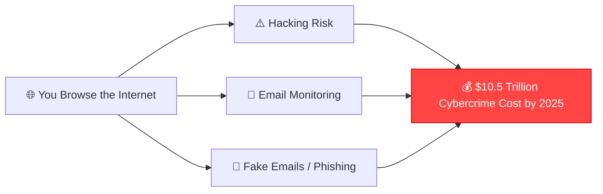

---

## 🔐 CIA Triad

The **CIA Triad** is the foundational model of information security. Every security measure maps back to one or more of these three principles.

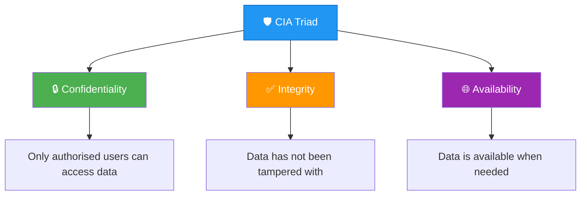

### 📊 CIA Triad — Definition Summary

| Principle | Definition | Key Question |
|---|---|---|
| **Confidentiality** | Only those with correct **authorisation** can access the data | *Who can see it?* |
| **Integrity** | Data has **not been tampered** with (intentionally or unintentionally) | *Has it been changed?* |
| **Availability** | Data is **accessible when needed** | *Can I get to it?* |

> **Source:** [SecurityNotepad — Information Security Principles](https://securitynotepad.wordpress.com/2019/06/17/information-security-principles-of-success-12-principles/)

---

### 🎓 CIA Triad �� Scenario: Online Exam Marks on GCU Learn

> [!example] Scenario
> The university releases online exam marks on GCU Learn. Three problems occur:

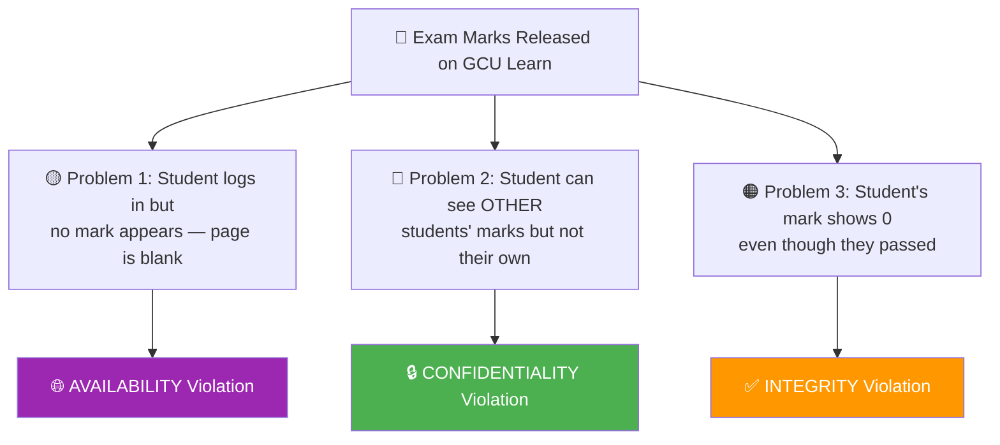

| Problem | Description | CIA Violation |
|---|---|---|
| **1** | Student logs in, no mark appears, page blank | **Availability** — data not accessible |
| **2** | Student sees other students' marks, not their own | **Confidentiality** — unauthorised access |
| **3** | Mark shows 0 even though they passed | **Integrity** — data has been altered/corrupted |

---

### 🔒 How to Achieve Confidentiality

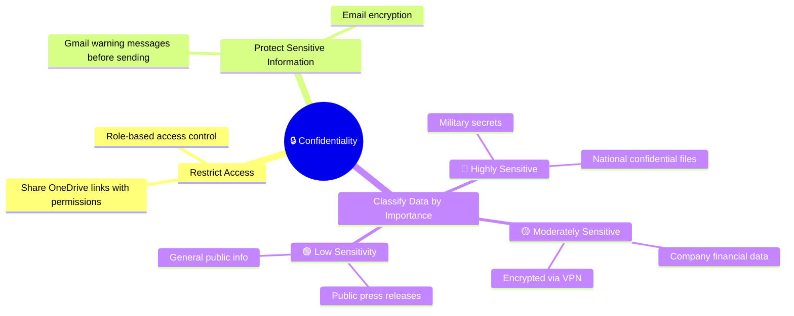

#### 📋 Data Classification Table

| Classification | Examples | Protection Measure |
|---|---|---|
| 🔴 **Highly Sensitive** | Military secrets, national confidential files | Top-level encryption, strict access control |
| 🟡 **Moderately Sensitive** | Company financial data | VPN encryption, limited access |
| 🟢 **Low Sensitivity** | Company press releases, public info | Standard access, minimal restrictions |

---

### ✅ How to Achieve Integrity

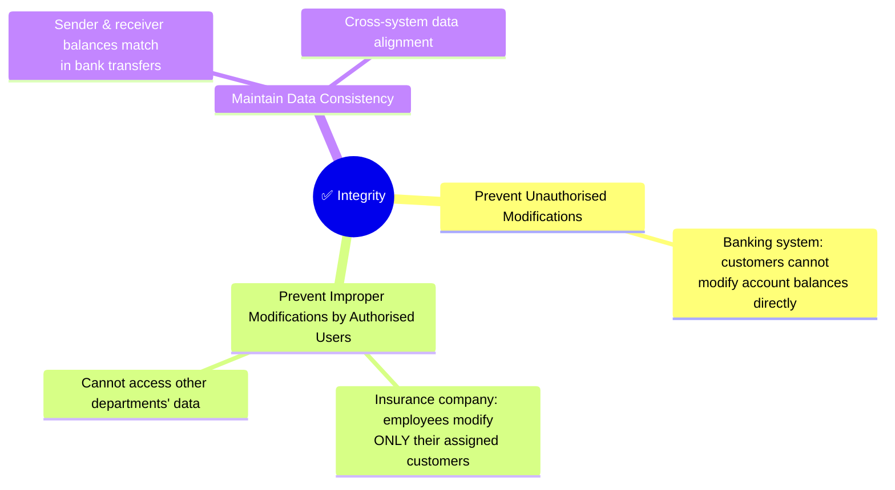

| Strategy | Example | Purpose |
|---|---|---|
| Block unauthorised modifications | Banking: customers can't edit balances | Prevents external tampering |
| Restrict authorised user scope | Insurance: employees only modify assigned customers | Prevents internal over-reach |
| Ensure consistency across systems | Bank transfers: sender − amount = receiver + amount | Data remains coherent |

---

### 🌐 How to Achieve Availability

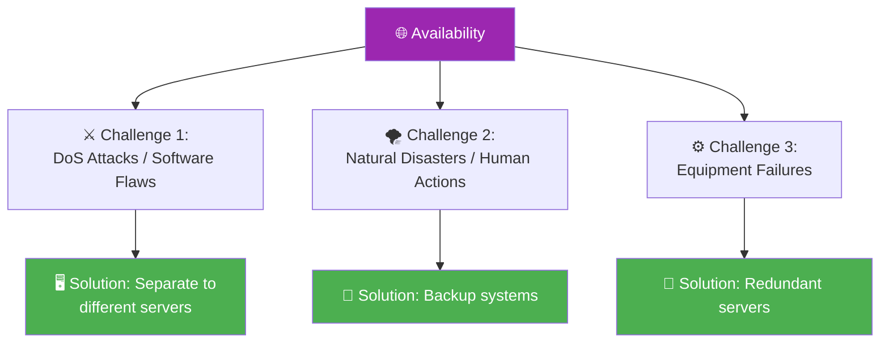

| Challenge | Cause | Solution |
|---|---|---|
| **DoS / Software flaws** | Intentional attacks or undiscovered implementation bugs (e.g., unexpected input crashes a program) | Distribute across **different servers** |
| **Natural disasters / Human actions** | Fires, floods, storms, earthquakes, bombs, strikes | **Backup** systems |
| **Equipment failures** | Normal hardware wear and tear | **Redundant** servers |

---

## 🔑 Cryptography

### 📖 Important Terms

> [!info] Definition
> **Cryptography** = The science of secret writing that enables you to **store and transmit data** in a form available **only to intended individuals**.

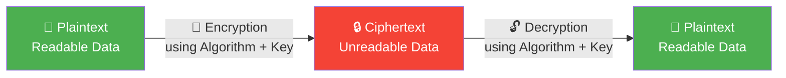
![[Pasted image 20260301192052.png]]

| Term | Definition |
|---|---|
| **Cryptography** | Science of secret writing for secure data storage & transmission |
| **Algorithm** | A set of **mathematical rules** used in encryption and decryption |
| **Encryption** | Transforming data into an **unreadable** format |
| **Decryption** | Transforming data back into a **readable** format |
| **Key** | A secret **sequence of bits and instructions** governing encryption/decryption |

> **Source:** [PGP Introduction — DidiSoft](https://pgpi.didisoft.com/doc/pgpintro/)

---

### 🔐 Algorithm Types Overview

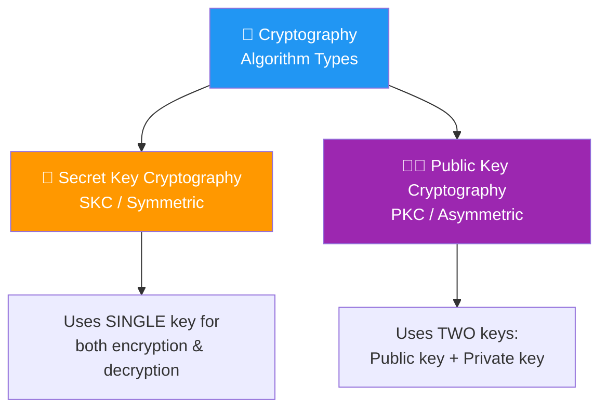

---

### 🔑 Secret Key Cryptography (SKC) — Symmetric

> Uses a **single secret key** (number, word, or random string) known to **both sender and recipient**.

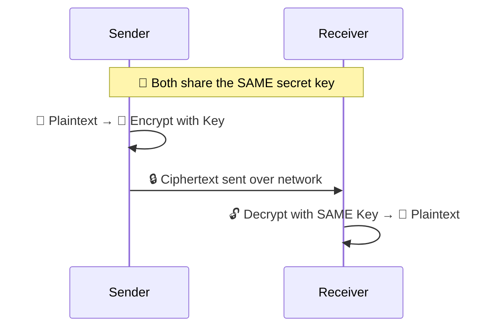

| Aspect | Detail |
|---|---|
| **Keys** | 1 shared secret key |
| ✅ **Pros** | Faster, identity verification, easy to execute |
| ❌ **Cons** | Limited scalability (key distribution problem) |

> **Source:** [SSL2Buy — Symmetric vs Asymmetric Encryption](https://www.ssl2buy.com/wiki/symmetric-vs-asymmetric-encryption-what-are-differences)

---

### 🔑🔑 Public Key Cryptography (PKC) — Asymmetric

> Uses **two keys**: a **public key** (shared with everyone) and a **private key** (kept secret by the owner).

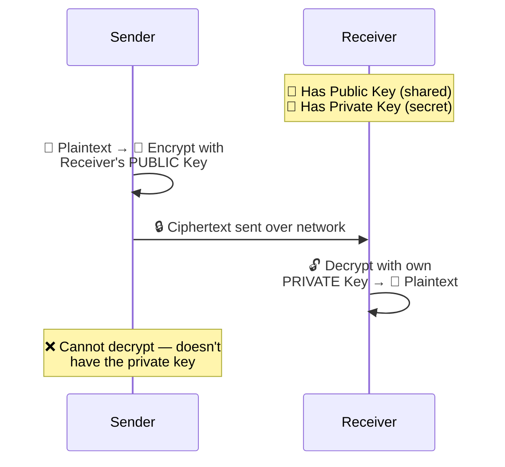

| Aspect     | Detail                                                                             |
| ---------- | ---------------------------------------------------------------------------------- |
| **Keys**   | 2 keys — public (shared) + private (secret)                                        |
| ✅ **Pros** | Easy key distribution, more scalable, safer                                        |
| ❌ **Cons** | Slower in performance, Not easy to implement and manage due to its large key sizes |

---

### ⚖️ SKC vs PKC Comparison

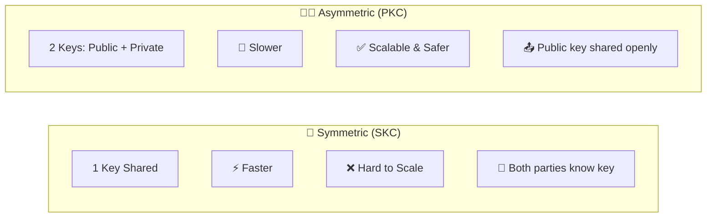

| Feature | SKC (Symmetric) | PKC (Asymmetric) |
|---|---|---|
| **Number of Keys** | 1 (shared) | 2 (public + private) |
| **Speed** | ⚡ Faster | 🐢 Slower |
| **Scalability** | ❌ Limited | ✅ More scalable |
| **Key Distribution** | 🔴 Difficult (must share securely) | 🟢 Easy (public key is open) |
| **Security** | Moderate | Higher |
| **Use Case** | Bulk data encryption | Key exchange, digital signatures |

---

## 🦠 Cybercrime

### 📖 Definition

> [!info] Definition
> **Cybercrime** = Any **illegal behaviour** directed by means of **electronic operations** that targets the **security of computer systems** and the **data processed** by them.

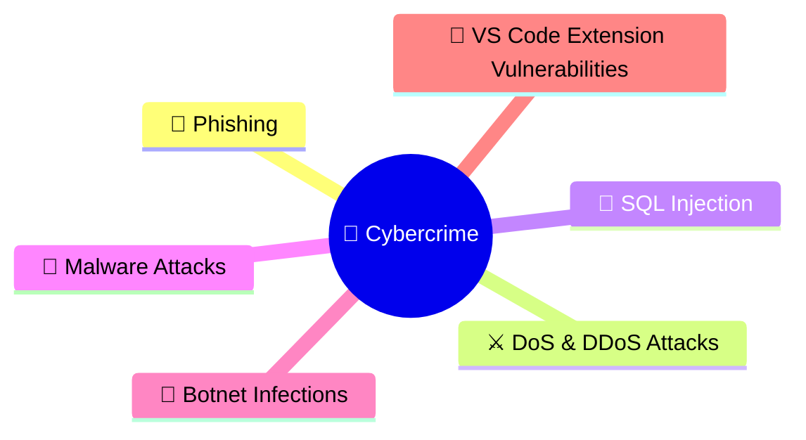

> **Stat:** Cybercrime costs projected to hit **$10.5 trillion by 2025**
> **Source:** [Business Standard](https://www.business-standard.com/finance/personal-finance/cybercrime-costs-to-hit-10-5-trn-by-2025-how-insurance-may-save-your-biz-124072400476_1.html)

---

### 📧 Phishing

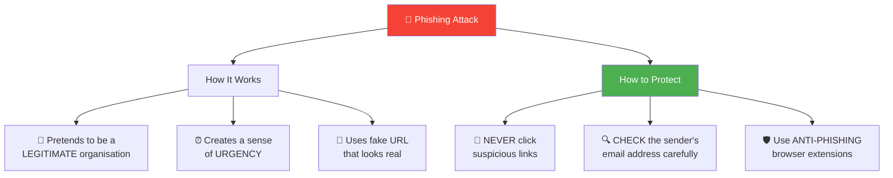

| Aspect | Details |
|---|---|
| **How it works** | Impersonates legitimate org → creates urgency → uses fake URL |
| **Protection** | Never click → Check email address → Use anti-phishing browser |

> **Source:** [PentestPartners — Microsoft Phishing Emails](https://www.pentestpartners.com/security-blog/microsoft-phishing-emails-and-lessons-to-learn/)

---

### ⚔️ DoS & DDoS Attacks

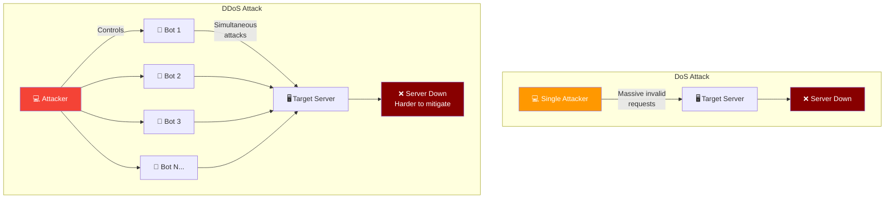

| Type | Mechanism | Difficulty to Mitigate |
|---|---|---|
| **DoS** | Single source sends massive invalid requests | Moderate |
| **DDoS** | Multiple infected devices (**botnets**) attack simultaneously | Very Hard |

> [!example] Real-World Example: GitHub DDoS Attack (2018)
> - **Scale:** 1.35 Tbps — one of the **largest attacks in history**
> - **Impact:** GitHub went **offline for 10 minutes**

---

### 💉 SQL Injection

> **SQL Injection** = Sending **invalid or untrusted data** to a web application by providing **malicious code** so the server processes it (via forms or URL query strings).

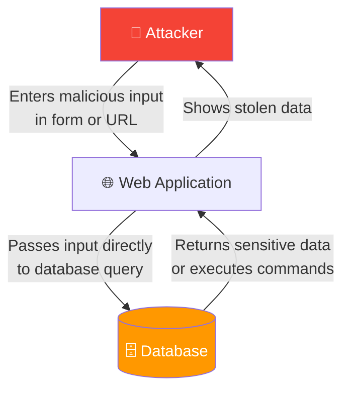

#### 🔒 SQL Injection Prevention Methods

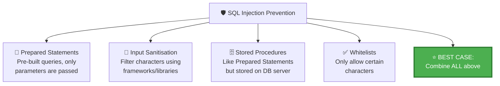

| Prevention Method | Description |
|---|---|
| **Prepared Statements** | Pre-built SQL statements; only parameters are passed in |
| **Input Sanitisation** | Filter all characters using framework/library sanitizers |
| **Stored Procedures** | Like prepared statements but stored on the database server side |
| **Whitelists** | Only allow specific permitted characters |
| ⭐ **Best Case** | **Combine all of the above** |

---

### 🐛 Other Cybercrime Types

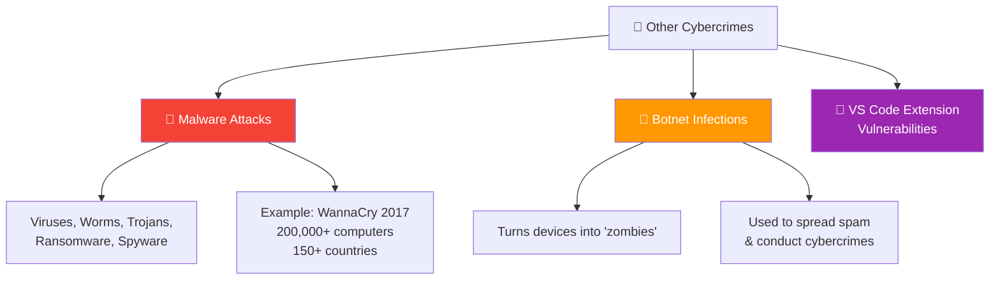

#### 🐛 Malware Attack

| Malware Type | Description |
|---|---|
| **Virus** | Attaches to files, spreads when executed |
| **Worm** | Self-replicates across networks without user action |
| **Trojan** | Disguises as legitimate software |
| **Ransomware** | Encrypts data, demands ransom for decryption |
| **Spyware** | Secretly monitors user activity |

> [!example] WannaCry Ransomware (2017)
> - Affected **200,000+ computers** in **150+ countries**
> - Exploited a Windows vulnerability

#### 🤖 Botnet Infection

- Turns devices into **"zombies"**
- Hackers use them to **spread spam** or **conduct cybercrimes**

#### 🛡️ How to Prevent

- ✅ **Regular backups**
- ✅ **Update firewall**
- ✅ **Do NOT download/open files from unknown sources**

---

## 💻 Google Colab Introduction

### 📖 What is Google Colab?

> [!info] Definition
> **Google Colab** = A **free cloud-based Jupyter Notebook environment** provided by Google that allows users to write and execute **Python code** through a **web browser**.

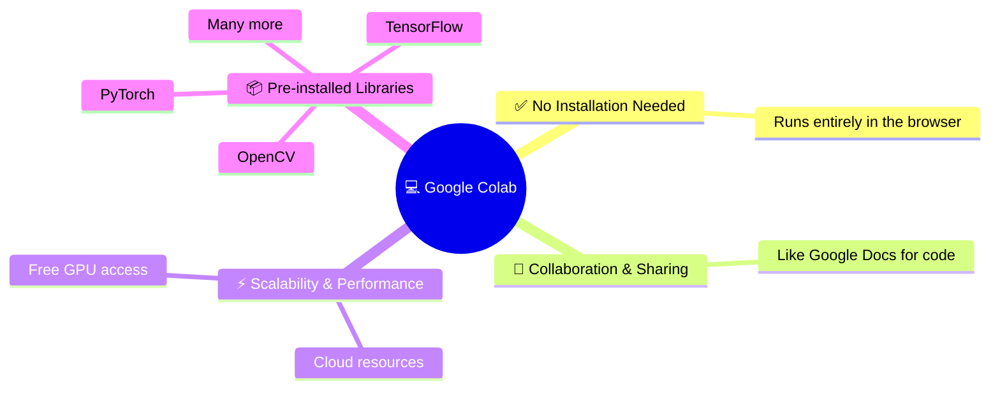

> **Link:** [Google Colab](https://colab.research.google.com/)

---

### ⚖️ VS Code vs Google Colab

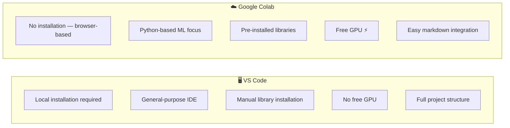

| Feature | VS Code | Google Colab |
|---|---|---|
| **Installation** | Required locally | ❌ No installation — runs in browser |
| **Focus** | General-purpose IDE | Python-based **machine learning** |
| **GPU Access** | ❌ Not included | ✅ **Free GPU** |
| **Libraries** | Manual installation | **Pre-installed** (TensorFlow, PyTorch, OpenCV, etc.) |
| **Markdown** | Limited | ✅ **Easy markdown** support |
| **Collaboration** | Via extensions/Git | Built-in **Google Docs-style** sharing |

---

## 🗺️ Complete Lecture Mind Map

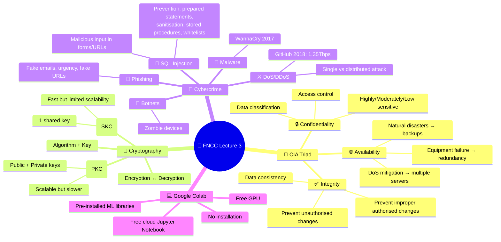

---

## 📝 Quick Revision Flashcards

| Question | Answer |
|---|---|
| What are the 3 pillars of the CIA Triad? | **Confidentiality, Integrity, Availability** |
| What does Confidentiality ensure? | Only **authorised users** can access data |
| What does Integrity ensure? | Data has **not been tampered** with |
| What does Availability ensure? | Data is **accessible when needed** |
| What is Cryptography? | Science of **secret writing** for secure data storage/transmission |
| What is the difference between SKC and PKC? | SKC uses **1 key** (symmetric); PKC uses **2 keys** (asymmetric) |
| What is a DoS attack? | Sending **massive invalid requests** from a single source |
| What is a DDoS attack? | Using **botnets** (multiple devices) to attack simultaneously |
| How do you prevent SQL Injection? | Prepared statements, input sanitisation, stored procedures, whitelists |
| What was the WannaCry attack? | 2017 ransomware affecting **200K+ computers** in **150+ countries** |
| What is Google Colab? | Free **cloud-based Jupyter Notebook** by Google for Python |
| What advantage does Colab have over VS Code? | **Free GPU**, no installation, pre-installed ML libraries |

---

## 🔗 References & Sources

- [SecurityNotepad — CIA Triad Principles](https://securitynotepad.wordpress.com/2019/06/17/information-security-principles-of-success-12-principles/)
- [DidiSoft — PGP Introduction (Cryptography)](https://pgpi.didisoft.com/doc/pgpintro/)
- [SSL2Buy — Symmetric vs Asymmetric Encryption](https://www.ssl2buy.com/wiki/symmetric-vs-asymmetric-encryption-what-are-differences)
- [Business Standard — Cybercrime Costs $10.5 Trillion by 2025](https://www.business-standard.com/finance/personal-finance/cybercrime-costs-to-hit-10-5-trn-by-2025-how-insurance-may-save-your-biz-124072400476_1.html)
- [PentestPartners — Microsoft Phishing Emails](https://www.pentestpartners.com/security-blog/microsoft-phishing-emails-and-lessons-to-learn/)
- [Google Colab](https://colab.research.google.com/)

---

> [!tip] Study Tip
> Use the **CIA Triad** as a mental framework for any security scenario. Ask yourself:
> 1. **Who can see it?** → Confidentiality
> 2. **Has it been changed?** → Integrity
> 3. **Can I access it?** → Availability