# 🔧 Lab 4: Actuators


---


![[Pasted image 20260217102510.png]]

---

## 🗺️ Lab Roadmap

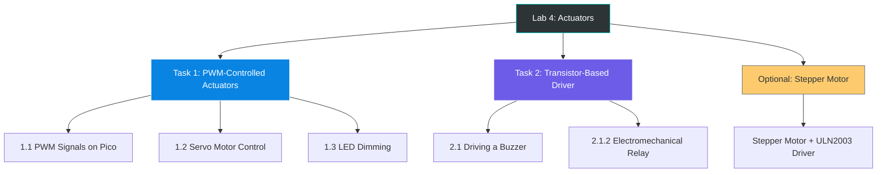
```mermaid
flowchart TD
    A["Lab 4: Actuators"] --> B["Task 1: PWM-Controlled Actuators"]
    A --> C["Task 2: Transistor-Based Driver"]
    A --> D["Optional: Stepper Motor"]

    B --> B1["1.1 PWM Signals on Pico"]
    B --> B2["1.2 Servo Motor Control"]
    B --> B3["1.3 LED Dimming"]

    C --> C1["2.1 Driving a Buzzer"]
    C --> C2["2.1.2 Electromechanical Relay"]

    D --> D1["Stepper Motor + ULN2003 Driver"]

    style A fill:#2d3436,stroke:#00cec9,color:#fff
    style B fill:#0984e3,stroke:#fff,color:#fff
    style C fill:#6c5ce7,stroke:#fff,color:#fff
    style D fill:#fdcb6e,stroke:#636e72,color:#2d3436
```

---

## 🧠 Core Concept: Sensors vs. Actuators

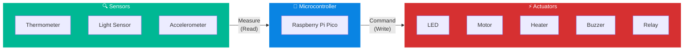
```mermaid
flowchart LR
    subgraph SENSORS["🔍 Sensors"]
        S1["Thermometer"]
        S2["Light Sensor"]
        S3["Accelerometer"]
    end

    subgraph MCU["🧮 Microcontroller"]
        M["Raspberry Pi Pico"]
    end

    subgraph ACTUATORS["⚡ Actuators"]
        A1["LED"]
        A2["Motor"]
        A3["Heater"]
        A4["Buzzer"]
        A5["Relay"]
    end

    SENSORS -->|"Measure\n(Read)"| MCU
    MCU -->|"Command\n(Write)"| ACTUATORS

    style SENSORS fill:#00b894,stroke:#fff,color:#fff
    style MCU fill:#0984e3,stroke:#fff,color:#fff
    style ACTUATORS fill:#d63031,stroke:#fff,color:#fff
```

| Aspect        | Sensors                         | Actuators                  |
| ------------- | ------------------------------- | -------------------------- |
| **Direction** | Real World → MCU                | MCU → Real World           |
| **Purpose**   | Measure magnitudes              | Change magnitudes          |
| **Examples**  | Thermometer, LDR, Accelerometer | LED, Motor, Heater, Buzzer |
| **Power**     | Usually low power               | Often need external power  |

> **Key Insight:** Sensors + Actuators together form a **control system** (e.g., thermometer + heater = temperature controller).

---

## ⚡ The Driver Problem

### Why Do We Need Drivers?

MCU GPIO pins have strict limitations:

| Parameter | Pico GPIO Limit | Typical Actuator Need |
|-----------|-----------------|----------------------|
| **Voltage** | 3.3V | 5V – 240V |
| **Current** | ~10 mA | 30 mA – several Amps |

### Driver Architecture

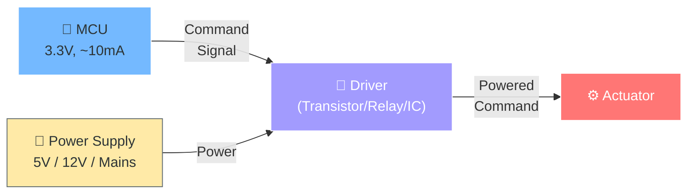
```mermaid
flowchart LR
    MCU["🧮 MCU\n3.3V, ~10mA"] -->|"Command\nSignal"| DRIVER["🔌 Driver\n(Transistor/Relay/IC)"]
    PS["🔋 Power Supply\n5V / 12V / Mains"] -->|"Power"| DRIVER
    DRIVER -->|"Powered\nCommand"| ACT["⚙️ Actuator"]

    style MCU fill:#74b9ff,stroke:#fff,color:#2d3436
    style DRIVER fill:#a29bfe,stroke:#fff,color:#fff
    style PS fill:#ffeaa7,stroke:#636e72,color:#2d3436
    style ACT fill:#ff7675,stroke:#fff,color:#fff
```

### Driver Classification

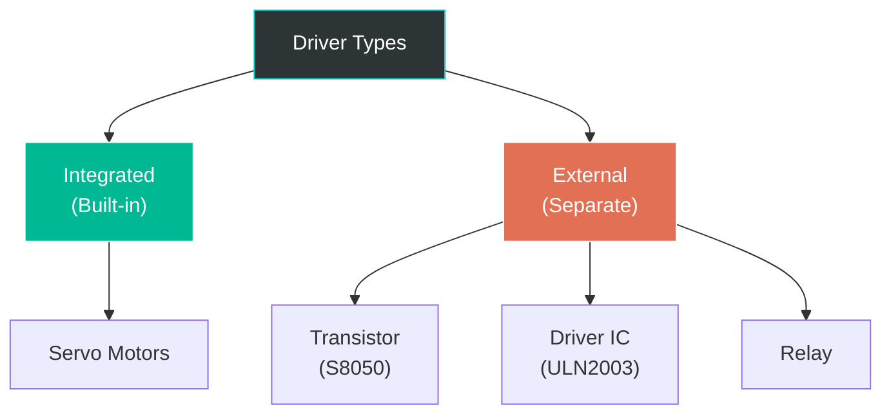
```mermaid
graph TD
    DR["Driver Types"] --> INT["Integrated\n(Built-in)"]
    DR --> EXT["External\n(Separate)"]

    INT --> SERVO["Servo Motors"]
    EXT --> TR["Transistor\n(S8050)"]
    EXT --> IC["Driver IC\n(ULN2003)"]
    EXT --> RL["Relay"]

    style DR fill:#2d3436,stroke:#00cec9,color:#fff
    style INT fill:#00b894,stroke:#fff,color:#fff
    style EXT fill:#e17055,stroke:#fff,color:#fff
```

---

## 📡 Task 1: PWM (Pulse Width Modulation)

### 1.1 PWM Fundamentals

#### What Is PWM?

A **digital output** that produces a periodic square wave, toggling between HIGH and LOW.

```
PWM Signal Anatomy
                    TPWM (Period)
         ◄──────────────────────────────►
         ┌────────┐                      ┌────────┐
   HIGH  │        │                      │        │
         │  tON   │       tOFF           │  tON   │
   LOW ──┘        └──────────────────────┘        └───
         ◄────────►◄─────────────────────►
            tON         tOFF = TPWM - tON
```

#### Key Equations

| Equation | Formula | Description |
|----------|---------|-------------|
| **Eq. 1** | `f_PWM = 1 / T_PWM` | Frequency ↔ Period relationship |
| **Eq. 2** | `d(%) = (tON / T_PWM) × 100` | Duty cycle as percentage |
| **Eq. 3** | `d(%) = tON × f_PWM × 100` | Duty cycle (substituted) |

#### Duty Cycle Visualization

```
d = 0% (Always OFF)
LOW  ─────────────────────────────────

d = 25%
      ┌──┐                  ┌──┐
HIGH  │  │                  │  │
LOW ──┘  └──────────────────┘  └──────

d = 50%
      ┌──────┐              ┌──────┐
HIGH  │      │              │      │
LOW ──┘      └──────────────┘      └──

d = 75%
      ┌──────────────┐      ┌─────────
HIGH  │              │      │
LOW ──┘              └──────┘

d = 100% (Always ON)
HIGH ─────────────────────────────────
```

### Pico PWM Hardware

The Pico has **8 independent PWM generators** (slices 0–7), each with **2 outputs** (A and B):

| Property | Shared (per slice) | Independent (per output) |
|----------|--------------------|--------------------------|
| Frequency | ✅ Same for A & B | ❌ |
| Duty Cycle | ❌ | ✅ Each output independent |
| Deinit | ⚠️ Deactivating one deactivates both | — |

#### PWM Pin Mapping Table (Selected)

| PWM Slice | Output A (GPIO) | Output B (GPIO) |
|-----------|----------------|----------------|
| 0 | GP0, GP16 | GP1, GP17 |
| 1 | GP2, GP18 | GP3, GP19 |
| 2 | GP4, GP20 | GP5, GP21 |
| 3 | GP6, GP22 | GP7, GP23 |
| 4 | GP8, GP24 | GP9, GP25 |
| 5 | GP10, GP26 | GP11, GP27 |
| 6 | GP12, GP28 | GP13, GP29 |
| 7 | GP14 | GP15 |

> **Note:** Multiple GPIO pins can share the same PWM output (e.g., GP1 and GP17 both map to PWM_B[0]), but each pin is configured **independently** — using one as PWM doesn't affect the other.

### MicroPython PWM API

```python
from machine import Pin, PWM
from time import sleep

  

led_onboard = Pin(25,Pin.OUT)
pwm_pin = PWM(Pin(17))
pwm_pin.freq(50) # 50Hz for servomotor
t_ON = 1.5 # 1.5ms, middle position
ns = int(t_ON * 1e6) #ms to nanoseconds
pwm_pin.duty_ns(ns) # rotate servo

  

while True:
    t_ON = float(input("t_ON in milliseconds (from 0.5 to 2.5; 0 to end): "))
    ns = int(t_ON * 1e6) #ms to nanoseconds
    if ns == 0:
        break

    led_onboard.value(1)
    pwm_pin.duty_ns(ns) #rotate servo
    sleep(1) #allow time to servo to complete the move
    led_onboard.value(0)

pwm_pin.deinit()          # Deactivate PWM on this pin, cleanup
```

| Method | Range | Unit | Notes |
|--------|-------|------|-------|
| `freq()` | Variable | Hz | Shared with sister output |
| `duty_u16()` | 0 – 65535 | Unitless (16-bit) | 0 = 0%, 65535 = 100% |
| `duty_ns()` | Variable | Nanoseconds | Direct tON specification |

---

### 1.2 Servo Motor Control

#### How Servos Work

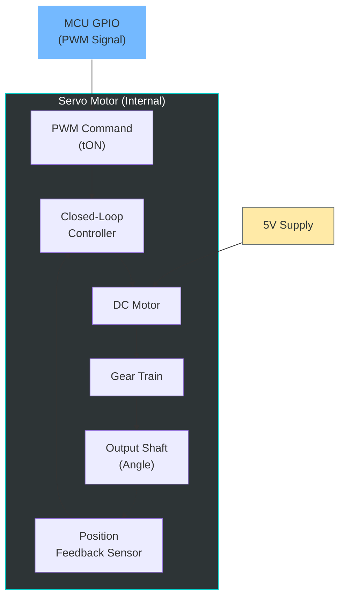
```mermaid
flowchart TD
    subgraph SERVO["Servo Motor (Internal)"]
        CMD["PWM Command\n(tON)"] --> CTRL["Closed-Loop\nController"]
        FB["Position\nFeedback Sensor"] --> CTRL
        CTRL --> MOT["DC Motor"]
        MOT --> GEAR["Gear Train"]
        GEAR --> SHAFT["Output Shaft\n(Angle)"]
        SHAFT -.-> FB
    end

    MCU["MCU GPIO\n(PWM Signal)"] --> CMD
    POWER["5V Supply"] --> MOT

    style SERVO fill:#2d3436,stroke:#00cec9,color:#fff
    style MCU fill:#74b9ff,stroke:#fff,color:#2d3436
    style POWER fill:#ffeaa7,stroke:#636e72,color:#2d3436
```

> Servos have a **built-in driver** — no external transistor needed!

#### Servo PWM Specification

| Parameter | Value |
|-----------|-------|
| **PWM Frequency** | 50 Hz |
| **PWM Period** | 20 ms (1/50) |
| **tON for 0°** | ≤ 0.5 ms |
| **tON for 90°** | 1.5 ms |
| **tON for 180°** | 2.5 ms |

#### Position vs. tON Mapping

```
Servo Angle vs. tON (within 20ms period)

  180° ─ ─ ─ ─ ─ ─ ─ ─ ─ ─ ─ ─ ─ ─ ─ •  (2.5ms)
       │                              ╱
       │                           ╱
       │                        ╱
   90° ─ ─ ─ ─ ─ ─ ─ ─ ─ • ╱          (1.5ms)
       │                ╱
       │             ╱
       │          ╱
    0° ─ ─ ─ •╱                        (0.5ms)
       └──────┬──────┬──────┬──────┬──
            0.5    1.0    1.5    2.0   2.5
                    tON (ms)
```

| Angle | tON (ms) | tON (ns) | Duty Cycle (%) |
|-------|----------|----------|----------------|
| 0° | 0.5 | 500,000 | 2.5% |
| 45° | 1.0 | 1,000,000 | 5.0% |
| 90° | 1.5 | 1,500,000 | 7.5% |
| 135° | 2.0 | 2,000,000 | 10.0% |
| 180° | 2.5 | 2,500,000 | 12.5% |

> **Tip:** 1 ms = 1,000 µs = 1,000,000 ns = `1e6` ns

#### Servo Wiring

```
SERVO PINOUT (3 wires)
���─────────────────────────┐
│     SERVO MOTOR         │
│                         │
│  ┌───┐  ┌───┐  ┌───┐   │
│  │ 1 │  │ 2 │  │ 3 │   │
└──┴─┬─┴──┴─┬─┴──┴─┬─┴───┘
     │      │      │
  YELLOW   RED   BROWN
  Signal   VCC    GND

Connections:
  BROWN  (GND)    → Pico GND (board pin 38)
  RED    (VCC)    → Pico VBUS 5V (board pin 40)
  YELLOW (Signal) → Pico GP17 (board pin 22)
```


---

### 1.3 LED Dimming with PWM

#### How It Works

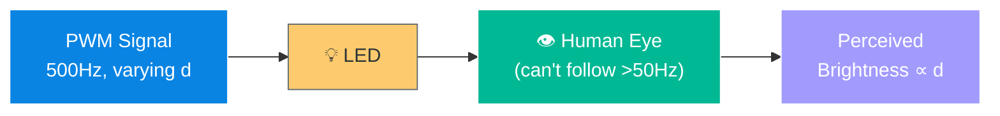
```mermaid
flowchart LR
    PWM["PWM Signal\n500Hz, varying d"] --> LED["💡 LED"]
    LED --> EYE["👁️ Human Eye\n(can't follow >50Hz)"]
    EYE --> PERCEPTION["Perceived\nBrightness ∝ d"]

    style PWM fill:#0984e3,stroke:#fff,color:#fff
    style LED fill:#fdcb6e,stroke:#636e72,color:#2d3436
    style EYE fill:#00b894,stroke:#fff,color:#fff
    style PERCEPTION fill:#a29bfe,stroke:#fff,color:#fff
```

| Duty Cycle | LED State (actual) | Perceived Brightness |
|------------|-------------------|---------------------|
| 100% | Always ON | Full brightness |
| 75% | ON 75%, OFF 25% | 75% brightness |
| 50% | ON 50%, OFF 50% | 50% brightness |
| 25% | ON 25%, OFF 75% | 25% brightness |
| 0% | Always OFF | Off |

> **Key:** The PWM frequency must be **much faster** than what the eye can follow (~50Hz). Using 500Hz is typical.

> **Experiment:** Lower the frequency to ~8Hz and you'll **see the blinking** instead of smooth dimming!

#### LED Wiring

```
Pico GP16 (board pin 21) ──── 220Ω Resistor ──── LED (+) ──── LED (-) ──── GND
```

#### LED Dimming Code


```python
from machine import Pin, PWM
from time import sleep

pwm_pin = PWM(Pin(16)) #using pin GP16 as PWM, LED her
e pwm_pin.freq(500) #500Hz for dimming LED
d = 100 #100%, full brighness

while d > 0: #dim down the LED
	pwm_pin.duty_u16(d * 65365 // 100) #set duty cycle -as u16!
	sleep(1) #let the user see the new brightness during 1 sec
	d = d - 10 #reduce perceived brightness in 10%
	
pwm_pin.deinit()
 # Turn off
```

#### PWM Purpose Comparison: Servo vs. LED

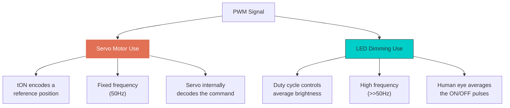
```mermaid
graph TD
    PWM["PWM Signal"] --> SERVO_USE["Servo Motor Use"]
    PWM --> LED_USE["LED Dimming Use"]

    SERVO_USE --> SV1["tON encodes a\nreference position"]
    SERVO_USE --> SV2["Fixed frequency\n(50Hz)"]
    SERVO_USE --> SV3["Servo internally\ndecodes the command"]

    LED_USE --> LD1["Duty cycle controls\naverage brightness"]
    LED_USE --> LD2["High frequency\n(>>50Hz)"]
    LED_USE --> LD3["Human eye averages\nthe ON/OFF pulses"]

    style SERVO_USE fill:#e17055,stroke:#fff,color:#fff
    style LED_USE fill:#00cec9,stroke:#2d3436,color:#2d3436
```

---

## 🔌 Task 2: Transistor-Based Driver

### 2.1 NPN Transistor as a Switch

#### The S8050 NPN Transistor

| Parameter | MCU Pin | S8050 Transistor |
|-----------|---------|-----------------|
| Max Voltage | 3.3V | **20V** |
| Max Current | ~10mA | **700mA** |

#### Transistor Pinout (S8050)

```
    S8050 (flat side facing you)
    ┌─────────────────┐
    │                 │
    │    FLAT SIDE    │
    │                 │
    └──┬────┬────┬────┘
       │    │    │
       E    B    C
    Emitter Base Collector
```

#### NPN Driver Circuit

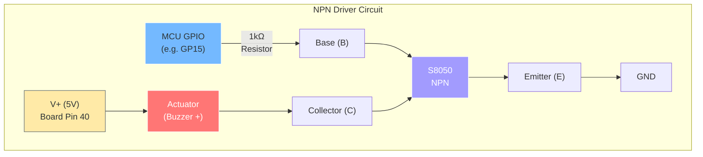
```mermaid
flowchart TD
    subgraph CIRCUIT["NPN Driver Circuit"]
        VCC["V+ (5V)\nBoard Pin 40"] --> ACT["Actuator\n(Buzzer +)"]
        ACT --> COL["Collector (C)"]
        MCU_PIN["MCU GPIO\n(e.g. GP15)"] -->|"1kΩ\nResistor"| BASE["Base (B)"]
        BASE --> TR["S8050\nNPN"]
        COL --> TR
        TR --> EMIT["Emitter (E)"]
        EMIT --> GND["GND"]
    end

    style VCC fill:#ffeaa7,stroke:#636e72,color:#2d3436
    style MCU_PIN fill:#74b9ff,stroke:#fff,color:#2d3436
    style TR fill:#a29bfe,stroke:#fff,color:#fff
    style ACT fill:#ff7675,stroke:#fff,color:#fff
```

#### How It Works

```
MCU Pin = LOW (0)           MCU Pin = HIGH (1)
─────────────────           ──────────────────
                            
  +5V                         +5V
   │                           │
  [Buzzer]                    [Buzzer]
   │                           │
   C                           C
   │  S8050                    │  S8050
   B──/── MCU (LOW)            B──── MCU (HIGH) via 1kΩ
   │                           │
   E                           E
   │                           │
  GND                         GND

→ No current flows           → Current flows through
→ Buzzer OFF                   buzzer → Buzzer ON!
```

#### Buzzer Wiring Details

| Component | From | To |
|-----------|------|-----|
| MCU GP15 (board pin 20) | — | 1kΩ Resistor |
| 1kΩ Resistor | GP15 | S8050 Base (middle pin) |
| S8050 Emitter (left pin) | — | Pico GND |
| Buzzer (+) | — | Pico VBUS 5V (board pin 40) |
| Buzzer (−) | — | S8050 Collector (right pin) |

#### Buzzer Code

```python
from machine import Pin
from time import sleep

buzzer_pin = Pin(15, Pin.OUT)

# Produce beeps
while True:
    buzzer_pin.value(1)   # Buzzer ON
    sleep(0.5)
    buzzer_pin.value(0)   # Buzzer OFF
    sleep(0.5)
```

---

### 2.1.2 Electromechanical Relay

#### Relay Architecture

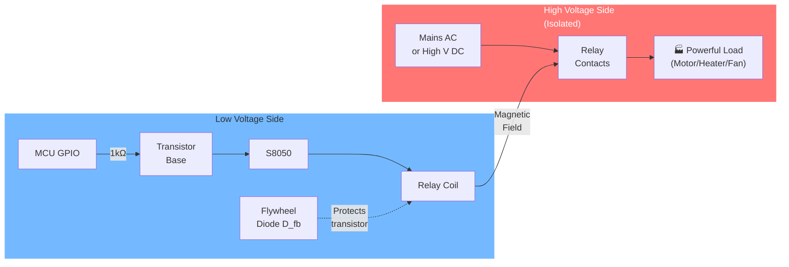
```mermaid
flowchart LR
    subgraph LOW_VOLTAGE["Low Voltage Side"]
        MCU["MCU GPIO"] -->|"1kΩ"| BASE["Transistor\nBase"]
        BASE --> NPN["S8050"]
        NPN --> COIL["Relay Coil"]
        DFB["Flywheel\nDiode D_fb"] -.->|"Protects\ntransistor"| COIL
    end

    subgraph HIGH_VOLTAGE["High Voltage Side\n(Isolated)"]
        MAINS["Mains AC\nor High V DC"] --> CONTACTS["Relay\nContacts"]
        CONTACTS --> LOAD["🏭 Powerful Load\n(Motor/Heater/Fan)"]
    end

    COIL -->|"Magnetic\nField"| CONTACTS

    style LOW_VOLTAGE fill:#74b9ff,stroke:#fff,color:#2d3436
    style HIGH_VOLTAGE fill:#ff7675,stroke:#fff,color:#fff
```

#### Relay Operation Sequence

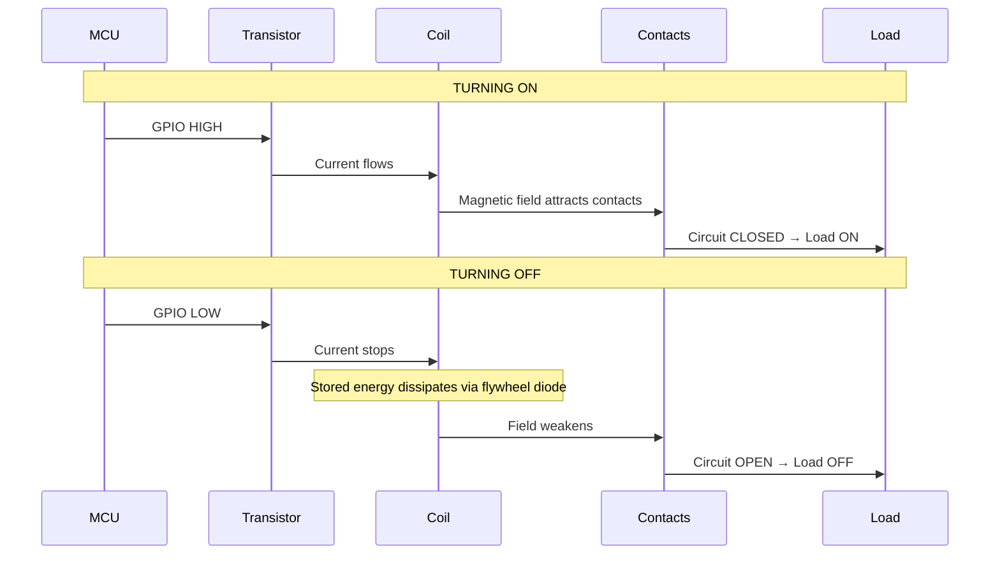
```mermaid
sequenceDiagram
    participant MCU
    participant Transistor
    participant Coil
    participant Contacts
    participant Load

    Note over MCU,Load: TURNING ON
    MCU->>Transistor: GPIO HIGH
    Transistor->>Coil: Current flows
    Coil->>Contacts: Magnetic field attracts contacts
    Contacts->>Load: Circuit CLOSED → Load ON

    Note over MCU,Load: TURNING OFF
    MCU->>Transistor: GPIO LOW
    Transistor->>Coil: Current stops
    Note over Coil: Stored energy dissipates via flywheel diode
    Coil->>Contacts: Field weakens
    Contacts->>Load: Circuit OPEN → Load OFF
```

| Feature | Advantage | Limitation |
|---------|-----------|------------|
| **Electrical isolation** | Coil & contacts physically separated | — |
| **High power** | Can handle very large V & I | — |
| **Versatility** | AC or DC loads | — |
| **Switching speed** | — | Slow (mechanical motion) |
| **Lifespan** | — | Mechanical wear |

> **Flywheel Diode (D_fb):** Protects the transistor by safely dissipating the energy stored in the relay coil's magnetic field when the transistor switches OFF.

---

## 🔄 Optional: Stepper Motor

### How Stepper Motors Work

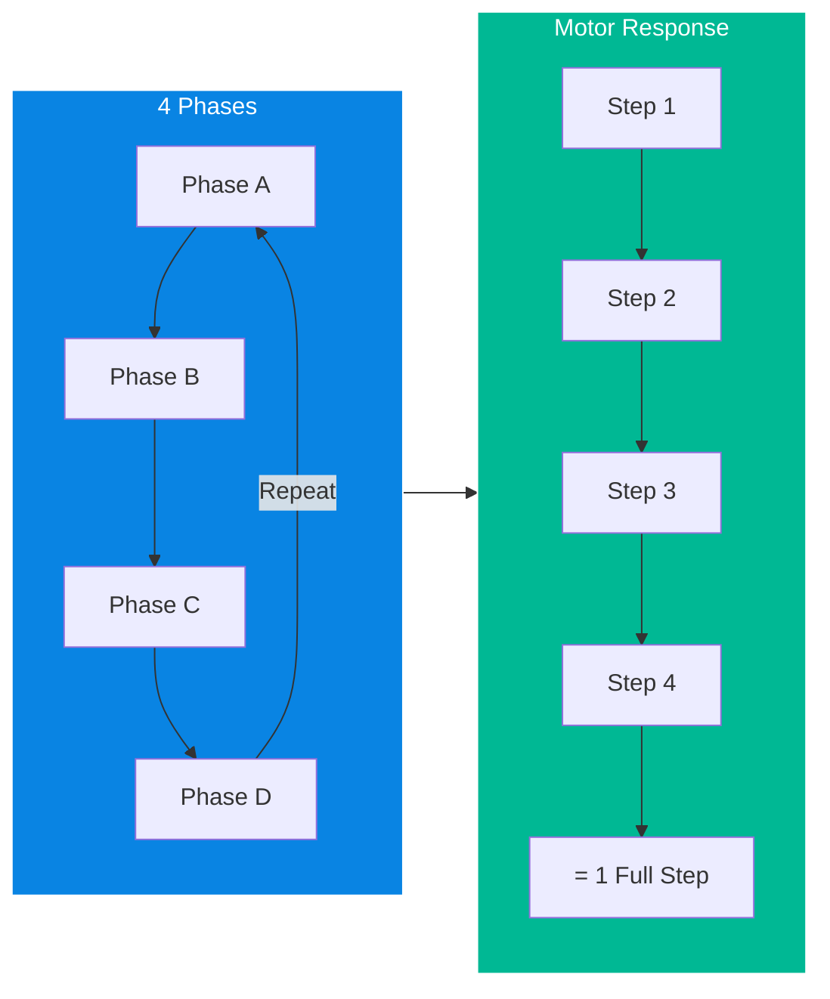
```mermaid
flowchart LR
    subgraph PHASES["4 Phases"]
        A["Phase A"] --> B["Phase B"]
        B --> C["Phase C"]
        C --> D["Phase D"]
        D -->|"Repeat"| A
    end

    subgraph MOTION["Motor Response"]
        STEP1["Step 1"] --> STEP2["Step 2"]
        STEP2 --> STEP3["Step 3"]
        STEP3 --> STEP4["Step 4"]
        STEP4 --> FULL["= 1 Full Step"]
    end

    PHASES --> MOTION

    style PHASES fill:#0984e3,stroke:#fff,color:#fff
    style MOTION fill:#00b894,stroke:#fff,color:#fff
```

#### Phase Activation Sequence

```
Forward Rotation: A → B → C → D → A → B → ...
Reverse Rotation: D → C → B → A → D → C → ...

Step | Phase A | Phase B | Phase C | Phase D
-----|---------|---------|---------|--------
  1  |   ON    |   OFF   |   OFF   |   OFF
  2  |   OFF   |   ON    |   OFF   |   OFF
  3  |   OFF   |   OFF   |   ON    |   OFF
  4  |   OFF   |   OFF   |   OFF   |   ON
  ↻  (repeat for continuous rotation)
```

### Stepper Specifications

| Parameter | Value |
|-----------|-------|
| **Full steps per revolution** | 2048 (with gear reduction) |
| **Phases** | 4 (A, B, C, D) |
| **Driver IC** | ULN2003 |
| **Speed control** | `sleep()` time between steps |

### Wiring

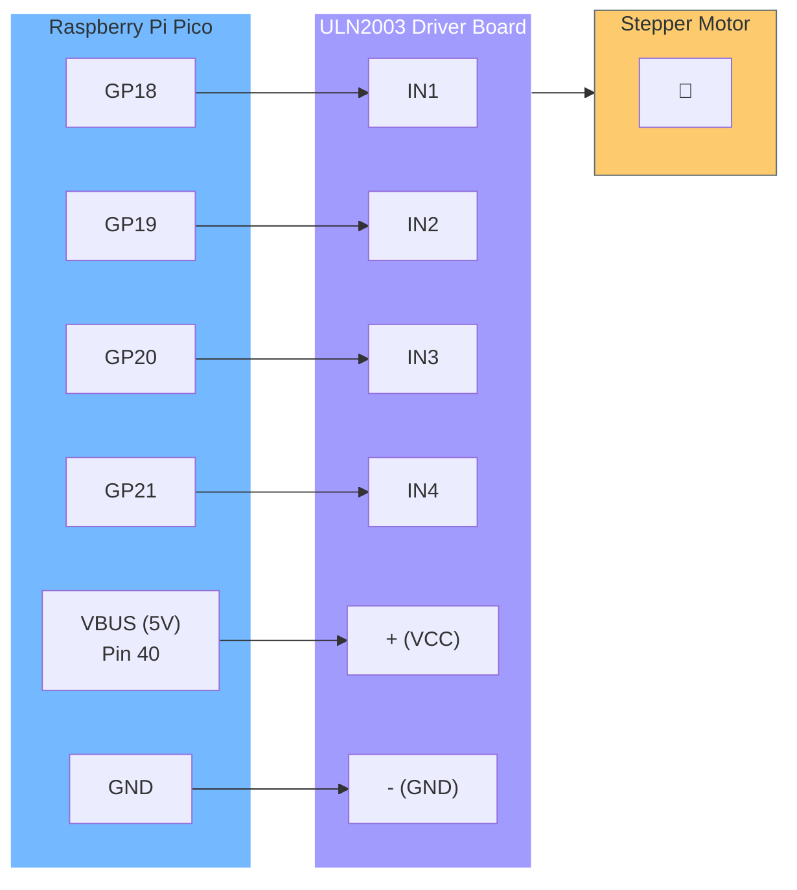
```mermaid
flowchart LR
    subgraph PICO["Raspberry Pi Pico"]
        GP18["GP18"]
        GP19["GP19"]
        GP20["GP20"]
        GP21["GP21"]
        VBUS["VBUS (5V)\nPin 40"]
        GND_P["GND"]
    end

    subgraph DRIVER["ULN2003 Driver Board"]
        IN1["IN1"]
        IN2["IN2"]
        IN3["IN3"]
        IN4["IN4"]
        VCC_D["+ (VCC)"]
        GND_D["- (GND)"]
    end

    subgraph MOTOR["Stepper Motor"]
        M["🔄"]
    end

    GP18 --> IN1
    GP19 --> IN2
    GP20 --> IN3
    GP21 --> IN4
    VBUS --> VCC_D
    GND_P --> GND_D
    DRIVER --> MOTOR

    style PICO fill:#74b9ff,stroke:#fff,color:#2d3436
    style DRIVER fill:#a29bfe,stroke:#fff,color:#fff
    style MOTOR fill:#fdcb6e,stroke:#636e72,color:#2d3436
```

| Pico GPIO | Board Pin | Driver Pin | Motor Phase |
|-----------|-----------|------------|-------------|
| GP18 | 24 | IN1 | Phase A |
| GP19 | 25 | IN2 | Phase B |
| GP20 | 26 | IN3 | Phase C |
| GP21 | 27 | IN4 | Phase D |
| VBUS | 40 | + | Power |
| GND | Any GND | - | Ground |

> ⚠️ **Order matters!** GP18→IN1, GP19→IN2, GP20→IN3, GP21→IN4

### Stepper Motor Code

```python
from machine import Pin

from time import sleep

led_onboard = Pin(25,Pin.OUT)

led_onboard.value(1)

A = Pin(18,Pin.OUT) #phase A

B = Pin(19,Pin.OUT) #phase B

C = Pin(20,Pin.OUT) #phase C

D = Pin(21,Pin.OUT) #phase D

n = int(input("Steps to do: "))

while n > 0:

    n = n-1

    D.value(0) # phase A  
    A.value(1)
    sleep(0.1)
    
    A.value(0) # phase B

    B.value(1)
    sleep(0.1)
    
    B.value(0) # phase C
    C.value(1)

    sleep(0.1)
    
    C.value(0) # phase D
    D.value(1)
    
    sleep(0.1)

D.value(0)

led_onboard.value(0)
# Note: 2048 full steps = 1 complete revolution
```

---

## 📊 Complete Actuator Comparison

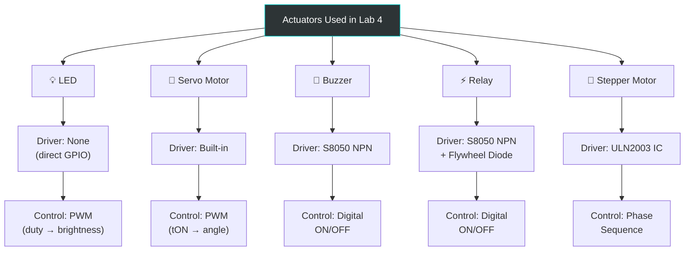
```mermaid
graph TD
    ACT["Actuators Used in Lab 4"] --> LED_A["💡 LED"]
    ACT --> SERVO_A["🔄 Servo Motor"]
    ACT --> BUZZ["🔔 Buzzer"]
    ACT --> RELAY_A["⚡ Relay"]
    ACT --> STEP["🔩 Stepper Motor"]

    LED_A --> LED_D["Driver: None\n(direct GPIO)"]
    SERVO_A --> SERVO_D["Driver: Built-in"]
    BUZZ --> BUZZ_D["Driver: S8050 NPN"]
    RELAY_A --> RELAY_D["Driver: S8050 NPN\n+ Flywheel Diode"]
    STEP --> STEP_D["Driver: ULN2003 IC"]

    LED_D --> LED_C["Control: PWM\n(duty → brightness)"]
    SERVO_D --> SERVO_C["Control: PWM\n(tON → angle)"]
    BUZZ_D --> BUZZ_C["Control: Digital\nON/OFF"]
    RELAY_D --> RELAY_C["Control: Digital\nON/OFF"]
    STEP_D --> STEP_C["Control: Phase\nSequence"]

    style ACT fill:#2d3436,stroke:#00cec9,color:#fff
```

| Actuator | Driver | Control Method | Power Source | Precision |
|----------|--------|---------------|-------------|-----------|
| **LED** | None (direct) | PWM duty cycle → brightness | 3.3V via GPIO | Low |
| **Servo** | Built-in | PWM tON → angle (0°–180°) | 5V USB | Medium |
| **Buzzer** | S8050 NPN transistor | Digital ON/OFF | 5V USB | N/A (binary) |
| **Relay** | S8050 + flywheel diode | Digital ON/OFF | Varies (load-dependent) | N/A (binary) |
| **Stepper** | ULN2003 IC | Phase sequence A→B→C→D | 5V USB | Very High |

---

## 📦 Appendix: Lab Materials Checklist

### Standard Kit
- [ ] Raspberry Pi Pico on breadboard + USB cable
- [ ] 1kΩ resistor (brown-black-red bands)
- [ ] 220Ω resistor (red-red-brown bands)
- [ ] LED
- [ ] S8050 NPN transistor
- [ ] Active buzzer (TMB12A05)
- [ ] Servo motor
- [ ] 5× male-male jumper wires

### Optional (Stepper Motor)
- [ ] Stepper motor
- [ ] 1× additional male-male jumper wire
- [ ] ULN2003 stepper motor driver board
- [ ] 6× male-female jumper wires

---

## 🧩 Key Takeaways

> [!important] **5 Things to Remember**
> 1. **Actuators change** the physical world; **sensors measure** it
> 2. **Drivers** bridge the gap between weak MCU pins and power-hungry actuators
> 3. **PWM for servos** = tON encodes position (time-encoded reference)
> 4. **PWM for LEDs** = duty cycle creates perceived average brightness
> 5. **Stepper motors** achieve high precision through sequential phase activation (2048 steps/revolution)

---

*Tags: #FNCC #Lab4 #Actuators #PWM #RaspberryPiPico #MicroPython #ServoMotor #Transistor #StepperMotor #Electronics*