# 🖥️ FNCC Lecture 3 — Processors and Actuators

## 1 — Processors Overview

### What is a Processor?

A **processor** is a digital device that **performs operations** on input information.

In **practical computing**, a processor:
- Takes **input from sensors**
- **Converts** it to a useful format (and possibly transmits it)
- **Makes decisions** and activates **actuators** to alter the environment

### Types of Processors

| Type | Purpose | Notes |
|------|---------|-------|
| **CPU** (Central Processing Unit) | General-purpose computation | Most common; handles logic, arithmetic, control |
| **GPU** (Graphics Processing Unit) | Video & graphics rendering | Relieves CPU from graphical tasks |
| **MCU** (Microcontroller Unit) | Embedded control | Low power, integrated I/O, limited compute |

```mermaid
graph LR
    S[🔌 Sensors] --> P[🧠 Processor]
    P --> A[⚙️ Actuators]
    P --> T[📡 Transmit Data]
    style P fill:#4a90d9,color:#fff
    style S fill:#7ec850,color:#fff
    style A fill:#e8793a,color:#fff
    style T fill:#9b59b6,color:#fff
```

> [!info] Key Insight
> A processor in practical computing is not just a CPU — it is any computing device that sits between **sensors** (input) and **actuators** (output).

---

## 2 — Microcontrollers (MCUs) as Processors

### What's Inside an MCU?

An MCU integrates **everything on a single chip**:

```mermaid
graph TD
    MCU["🔲 MCU (Single Chip)"]
    MCU --> CPU["🧠 CPU (Processor Core)"]
    MCU --> RAM["💾 RAM Memory"]
    MCU --> IO["📌 I/O Ports (GPIO)"]
    MCU --> ADC["📊 ADC (Analog-to-Digital Converter)"]
    MCU --> COMM["🔗 Communication (I²C, SPI, UART)"]
    style MCU fill:#2c3e50,color:#fff
    style CPU fill:#3498db,color:#fff
    style RAM fill:#e74c3c,color:#fff
    style IO fill:#2ecc71,color:#fff
    style ADC fill:#f39c12,color:#fff
    style COMM fill:#9b59b6,color:#fff
```

### Why Limited Computational Power?

> [!question] Why are MCUs so limited?
> Because they are designed for **low power consumption** and **embedded use**, not general-purpose computing. The trade-off is: **less power draw = less computational capability**.

---

## 3 — The Power of Computing

### Power Consumption Comparison

| Device | Power Consumption | Notes |
|--------|-------------------|-------|
| 💻 Laptop | ~150 W | Includes screen |
| 🎮 High-end Gaming PC | ~800 W | + ~50 W for 24" LCD |
| 🟢 Raspberry Pi Pico (RP2040) | ~0.1 W | No screen intended |

```
Power Consumption (Watts) — Log Scale Visualisation
═══════════════════════════════════════════════════

Gaming PC   ████████████████████████████████████████ 800 W
Laptop      ███████████████████                      150 W
RPi Pico    ▎                                        0.1 W

            0.1W        1W        10W      100W     1000W
```

### MCU Design Trade-offs

```mermaid
graph TD
    LP["🔋 LOW POWER"] --> NG["❌ No Graphics Support"]
    LP --> LF["❌ Low Clock Freq (MHz, not GHz)"]
    LP --> TR["❌ Tiny RAM (kB, not GB/TB)"]
    LP --> NS["❌ Small Storage (a few MB)"]
    LP --> NF["❌ No Floating-Point Co-processor"]
    LP --> BL["✅ Maximised Battery Life"]
    style LP fill:#27ae60,color:#fff
    style BL fill:#27ae60,color:#fff
    style NG fill:#e74c3c,color:#fff
    style LF fill:#e74c3c,color:#fff
    style TR fill:#e74c3c,color:#fff
    style NS fill:#e74c3c,color:#fff
    style NF fill:#e74c3c,color:#fff
```

> [!warning] MicroPython Limitation
> MicroPython is **not recommended** for **battery-critical** or **time-critical** applications due to its interpretation overhead.

### CPU vs MCU Summary

| Feature | CPU (Laptop/PC) | MCU (e.g. RP2040) |
|---------|-----------------|-------------------|
| Clock Speed | GHz | MHz |
| RAM | GB – TB | kB |
| Storage | GB – TB | MB |
| Power | 50–800 W | 0.01–0.5 W |
| Graphics | Yes (GPU) | No |
| Floating-point | Yes | Usually No |
| Target Use | General purpose | Embedded / IoT |

---

## 4 — Actuators Overview

### What is an Actuator?

An **actuator** allows an electronic device (like an MCU) to **act on the external world** to produce a physical change. We want actuators that can be **activated electrically**.

### Classification of Common Actuators

```mermaid
graph TD
    ACT["⚙️ ELECTRIC ACTUATORS"]
    ACT --> HUM["👤 For Humans"]
    ACT --> MOT["🔄 Motors"]
    ACT --> MAG["🧲 Electromagnets / Solenoids"]
    
    HUM --> LED["💡 LEDs"]
    HUM --> DSP["🖥️ Displays"]
    HUM --> BUZ["🔊 Buzzers / Speakers"]
    
    MOT --> SRV["Servo Motor"]
    MOT --> DCM["DC Motor (Brushed)"]
    MOT --> STP["Stepper Motor"]
    
    MOT --> MECH["Mechanical Elements"]
    MECH --> WHL["Wheels"]
    MECH --> FAN["Fans"]
    MECH --> PRP["Propellers"]
    MECH --> RAP["Rack-and-Pinion"]
    
    MAG --> ELV["Electrovalves"]
    MAG --> DRH["Door Holders"]
    MAG --> MGR["Magnetic Grippers"]
    MAG --> SPK["Speakers"]
    
    style ACT fill:#2c3e50,color:#fff
    style HUM fill:#3498db,color:#fff
    style MOT fill:#e67e22,color:#fff
    style MAG fill:#9b59b6,color:#fff
```

---

## 5 — Analog Outputs & DAC

### Digital vs Analog Outputs

| Output Type | Description | Use Case |
|-------------|-------------|----------|
| **Digital** | ON or OFF (binary) | All/nothing actuators (relay, LED on/off) |
| **Analog** | Continuous voltage | Speed control (DC motor), dimming |

### Digital-to-Analog Converter (DAC)

- Creates an **analog output voltage** (usually 0 V to supply voltage)
- Proportional to a **raw integer value** (e.g. 0–1023 for a 10-bit DAC)
- Can only supply **a few mA** — not a variable voltage supply!

```
DAC Output Voltage (10-bit example, Vdd = 3.3V)
═══════════════════════════════════════════════

Raw Value:    0        256       512       768      1023
Voltage:    0.0V     0.825V    1.65V    2.475V    3.3V
              │        │         │         │        │
              ▼        ▼         ▼         ▼        ▼
         ─────┴────────┴─────────┴─────────┴────────┴─────
              0%       25%      50%       75%     100%
```

> [!important] DAC Limitations
> - **Expensive** component
> - Only found in **higher-end MCUs**
> - Can supply very **little current** (mA)
> - That's why a **cheaper alternative** exists → **PWM**

---

## 6 — Pulse Width Modulation (PWM)

### Concept

PWM is a **cheap digital output** that **approximates** an analog (continuous) output.

### Key Formulas

$$d = \frac{t_{ON}}{t_{ON} + t_{OFF}} = \frac{t_{ON}}{T_{PWM}}$$

$$V_{average} = d \times V_{HIGH}$$

Where:
- $d$ = **duty cycle** (0 to 1, or 0% to 100%)
- $t_{ON}$ = time the signal is HIGH
- $T_{PWM}$ = total period of the PWM cycle
- $V_{HIGH}$ = logic-high voltage level

### Duty Cycle Visual Guide

![[Pasted image 20260216113623.png]]

```
   0% Duty Cycle          50% Duty Cycle         100% Duty Cycle
   (Always OFF)           (Half ON)              (Always ON)
   Vavg = 0V              Vavg = 1.65V           Vavg = 3.3V

   25% Duty Cycle          75% Duty Cycle
   Vavg = 0.825V           Vavg = 2.475V

```

### PWM Period & Human Perception (LED Dimming)

| PWM Period | Frequency | Human Eye Can Follow? | Effect |
|------------|-----------|----------------------|--------|
| 2 s | 0.5 Hz | ✅ Yes — sees blinking | Obvious ON/OFF |
| 10 ms | 100 Hz | ❌ No — sees average | Smooth dimming |

> [!tip] Practical Rule
> **Switch faster than the eye/ear/motor can follow** → the device responds to the **average** voltage, not the individual pulses.

---

## 7 — Electronic Drivers

## Electronic drivers relay the commands from the MCU and provides the power required by the actuator to work

### Why Do We Need Drivers?

MCU outputs can only supply **a few milliamperes** — that's **not enough** to power most actuators directly.


### The Role of an Electronic Driver

```mermaid
graph LR
    subgraph "Control Side (Low V & I)"
        MCU["🧠 MCU Output<br/>3.3V, ~4mA"]
    end

    subgraph "Driver"
        DRV["🔌 Electronic<br/>Driver"]
    end

    subgraph "Power Side (High V & I)"
        ACT["⚙️ Actuator<br/>12V, 2A"]
    end

    MCU --> DRV --> ACT
    PWR["🔋 External<br/>Power Supply"] --> DRV

    style MCU fill:#3498db,color:#fff
    style DRV fill:#f39c12,color:#fff
    style ACT fill:#e74c3c,color:#fff
    style PWR fill:#27ae60,color:#fff
```

### Types of Electronic Drivers

```mermaid
graph TD
    ED["🔌 ELECTRONIC DRIVERS"]
    
    ED --> RLY["⚡ Electromechanical Relay"]
    ED --> TRN["🔲 Discrete Transistors"]
    ED --> INT["📦 Specialised Integrated Drivers"]
    
    RLY --> RN1["Coil activated → magnetically operates switches"]
    RLY --> RN2["High voltage/current capacity"]
    RLY --> RN3["Occasional switching only"]
    RLY --> RN4["Usually needs a transistor to drive the coil"]
    
    TRN --> TN1["Used as 'controlled switches'"]
    TRN --> BJT["BJT — Cheaper"]
    TRN --> MOS["MOSFET — Easier, but needs ≥ 5V"]
    
    INT --> IN1["Contains integrated transistors"]
    INT --> IN2["Purpose-built for specific actuators"]
    
    style ED fill:#2c3e50,color:#fff
    style RLY fill:#e74c3c,color:#fff
    style TRN fill:#3498db,color:#fff
    style INT fill:#9b59b6,color:#fff
```

### Driver Comparison Table

| Driver Type | Cost | Switching Speed | Current Capacity | Complexity |
|-------------|------|-----------------|-----------------|------------|
| **Relay** | Medium | Slow (mechanical) | Very High (10A+) | Low |
| **BJT Transistor** | Low | Fast | Medium | Medium |
| **MOSFET** | Medium | Very Fast | High | Low (≥5V gate) |
| **Integrated Driver** | Higher | Fast | High (varies) | Low (easy to use) |

---

## 8 — Solenoids & General Load Activation

### How Solenoids Work

A **solenoid** creates a **magnetic field** when activated, attracting metal parts to create **mechanical motion**.

### Solenoid Drive Circuit

```
         +Vdd
          │
          │
       ┌──┴──┐
       │SOLE-│
       │NOID │
       │ 🧲  │
       └──┬──┘
     ┌────┤ ←── Flyback Diode (protection)
     │    │       (dissipates stored magnetic energy
     │    │        when transistor switches OFF)
     ▼    │
   ┌─┴─┐  │
   │ D  │  │
   └─┬─┘  │
     │    │
     └────┤
          │
       ┌──┴──┐
  MCU──┤TRANS│
  GPIO │ISTOR│
       └──┬──┘
          │
         GND
```

         

> [!warning] Flyback Diode
> When a solenoid (inductive load) is switched **OFF**, the collapsing magnetic field generates a **voltage spike** that can damage the transistor. A **flyback diode** placed across the solenoid provides a safe path for this energy to dissipate.

### Other Loads Using Same Approach

This transistor + flyback diode circuit works for:
- 🔊 **Buzzers**
- 💡 **Light bulbs**
- 🔥 **Heaters**
- Any **inductive or resistive** ON/OFF load

---
### For more powerful solenoids, an electromechanical relay can replace the transistor
• A transistor may be needed to drive the relay's coil itself
## 9 — Brushed DC Motors

### Operating Principle

![[Pasted image 20260216114458.png]]

```mermaid
graph TD
    subgraph STATOR
        PM["🧲 Permanent Magnets<br/>(constant magnetic field)"]
    end
    
    subgraph ROTOR
        RW["🔄 Rotor Windings<br/>(electromagnet)"]
        BC["⚡ Brush Contacts<br/>(commutator)"]
    end
    
    PM -->|"Magnetic interaction"| RW
    RW -->|"Tries to align"| BC
    BC -->|"Reverses polarity<br/>just before alignment"| RW
    
    style PM fill:#e74c3c,color:#fff
    style RW fill:#3498db,color:#fff
    style BC fill:#f39c12,color:#fff
```

### Step-by-Step Operation

1. **Permanent magnets** in the stator create a **constant magnetic field**
2. **Current** through rotor windings converts rotor into an **electromagnet**
3. Rotor **turns to align** its magnetic field with the stator's
4. **Just before alignment**, brush contacts **mechanically invert** the polarity
5. Rotor's magnetic field **reverses** → provokes a new turn → **continuous rotation**
### DC Motor Key Properties

| Property | Relationship |
|----------|-------------|
| **Speed** | Proportional to **average rotor voltage** |
| **Direction** | Changes with **voltage polarity** |
| **Torque** | Proportional to **demanded current** |

### Advantages & Issues

| ✅ Advantages | ⚠️ Issues |
|--------------|----------|
| Cheap | Brush wear over time |
| Good for speed control (via PWM) | Electrical noise from brushes |
| Simple to drive | Sparking at commutator |

---

## 10 — Driving a DC Motor & H-Bridge

### Single Direction: Transistor + PWM

```
         +Vdd
          │
       ┌──┴──┐
       │  DC │
       │MOTOR│
       │  🔄 │
       └──┬──┘
     ┌────┤  ←── Flyback Diode
     │    │
     └────┤
          │
       ┌──┴──┐
  PWM──┤TRANS│  ← MCU sends PWM to control speed
  from │ISTOR│
  MCU  └──┬──┘
          │
         GND
```

### Bi-Directional: H-Bridge

```
          +Vdd                    +Vdd
           │                       │
     ┌─────┤                       ├─────┐
     │     │                       │     │
  ┌──┴──┐  │                       │  ┌──┴──┐
  │ Q1  │  │      DC MOTOR        │  │ Q2  │
  │(NPN)│  │     ┌───────┐        │  │(NPN)│
  └──┬──┘  │     │       │        │  └──┬──┘
     │     ├─────┤  M 🔄 ├────────┤     │
     │     │     │       │        │     │
  ┌──┴──┐  │     └───────┘        │  ┌──┴──┐
  │ Q3  │  │                       │  │ Q4  │
  │(NPN)│  │                       │  │(NPN)│
  └──┬──┘  │                       │  └──┬──┘
     │     │                       │     │
     └─────┤                       ├─────┘
           │                       │
          GND                     GND


  FORWARD:  Q1 + Q3 ON, Q2 + Q4 OFF  →  +VR
  REVERSE:  Q2 + Q4 ON, Q1 + Q3 OFF  →  -VR
```

### H-Bridge Truth Table

| Q1 | Q2 | Q3 | Q4 | Motor Action |
|----|----|----|-----|-------------|
| ON | OFF | ON | OFF | ⏩ Forward |
| OFF | ON | OFF | ON | ⏪ Reverse |
| OFF | OFF | OFF | OFF | 🛑 Stop (coast) |
| ON | OFF | OFF | ON | 🔒 Brake |

### Integrated H-Bridge Controller

In practice, the H-Bridge is implemented as an **integrated controller IC** (e.g. L298N, DRV8833):

```mermaid
graph LR
    MCU["🧠 MCU"]
    MCU -->|"PWM (speed)"| IC["📦 H-Bridge IC"]
    MCU -->|"GPIO (direction)"| IC
    PWR["🔋 Motor Power"] --> IC
    IC --> MOT["🔄 DC Motor"]
    style MCU fill:#3498db,color:#fff
    style IC fill:#f39c12,color:#fff
    style MOT fill:#e74c3c,color:#fff
```


![[Pasted image 20260216114634.png]]

| MCU Signal       | Function                              |
| ---------------- | ------------------------------------- |
| **PWM**          | Controls motor **speed** (duty cycle) |
| **GPIO digital** | Controls rotation **direction**       |
|                  |                                       |

---

## 11 — Servo Motors

### What is a Servo Motor?

A servo motor is designed for **position (angle) control**, usually with **rotation limits** (e.g. 0°–270°, or ¾ of a revolution).

### Typical Uses

- 🚗 Steering of RC vehicles (wheels, rudders, ailerons)
- 📷 Moving turrets and gimbals
- 🤖 Robotic joint positioning

### Internal Architecture


### PWM Position Control Protocol

| Parameter | Value |
|-----------|-------|
| PWM Frequency | **50 Hz** (T_PWM = 20 ms) |
| Middle position (90°) | t_ON = **1.5 ms** |
| Minimum position (0°) | t_ON = **~1.0 ms** |
| Maximum position (180°) | t_ON = **~2.0 ms** |

```
Servo PWM Signal (50 Hz, T = 20ms)
═══════════════════════════════════

0° Position (tON ≈ 1.0 ms):
┌─┐                                    ┌─┐
│ │                                    │ │
┘ └────────────────────────────────────┘ └───
 1ms              19ms

90° Position (tON = 1.5 ms):
┌──┐                                   ┌──┐
│  │                                   │  │
┘  └───────────────────────────────────┘  └──
 1.5ms           18.5ms

180° Position (tON ≈ 2.0 ms):
┌───┐                                  ┌───┐
│   │                                  │   │
┘   └──────────────────────────────────┘   └─
 2.0ms           18ms
```

> [!tip] Key Insight
> With servos, it's the **pulse width** (t_ON) that controls position — NOT the duty cycle in the traditional sense. The frequency stays fixed at 50 Hz.

---

## 12 — Stepper Motors

### What is a Stepper Motor?

A stepper motor is designed for **very precise position control** with relatively **low speed** requirements.

### Typical Uses

- 🖨️ **3D printers** (X, Y, Z axis movement)
- 🔧 **CNC machines** (axis positioning)
- 📸 Camera slider mechanisms

### Operating Principle

```
    Stepper Motor Cross-Section (Simplified)
    ═════════════════════════════════════════

    STATOR (outer, with electromagnetic coils):
    ┌────────────────────────────────┐
    │  [A+]     [B+]     [A+]      │
    │    ╲       │       ╱         │
    │     ╲      │      ╱          │
    │      ┌─────┴─────┐           │
    │ [B-]─┤  ROTOR ↻  ├─[B+]     │
    │      │  (teethed) │          │
    │      └─────┬─────┘           │
    │     ╱      │      ╲          │
    │    ╱       │       ╲         │
    │  [A-]     [B-]     [A-]      │
    └────────────────────────────────┘

    Stator coils activate in SEQUENCE →
    Rotor moves one STEP at a time
    to align its teeth with energised poles
```

### Step-by-Step Operation

1. Stator windings **sequentially magnetise** specially-shaped teethed poles
2. The rotor moves a **small angle (step)** to align its own teeth with the currently energised stator teeth
3. Next coil pair energises → rotor takes another step
4. Repeat → precise rotational movement

### Integrated Stepper Controller (e.g. DRV8880)

```mermaid
graph LR
    MCU["🧠 MCU"]
    MCU -->|"DIRECTION pin<br/>(GPIO: 0 or 1)"| DRV["📦 Stepper Driver<br/>(e.g. DRV8880)"]
    MCU -->|"STEP pin<br/>(PWM pulses)"| DRV
    PWR["🔋 Motor Power"] --> DRV
    DRV --> STP["⚙️ Stepper Motor"]
    style MCU fill:#3498db,color:#fff
    style DRV fill:#f39c12,color:#fff
    style STP fill:#e74c3c,color:#fff
```

### Control Signals

| Signal | Function | Details |
|--------|----------|---------|
| **DIRECTION** | Selects turn direction | GPIO: `1` = CW, `0` = CCW |
| **STEP** | Each pulse = 1 step | Use PWM for continuous rotation |

### Using PWM for Speed Control

| PWM Parameter | Effect on Stepper |
|---------------|-------------------|
| **Frequency (Hz)** | Determines **rotation speed** (steps/sec) |
| **Duty Cycle** | **Not relevant** — set to 50% |
| **Number of pulses** | Determines **total rotation angle** |

```
STEP signal (PWM at 200 Hz = 200 steps/sec):

    ┌─┐ ┌─┐ ┌─┐ ┌─┐ ┌─┐ ┌─┐ ┌─┐ ┌─┐
    │ │ │ │ │ │ │ │ │ │ │ │ │ │ │ │
────┘ └─┘ └─┘ └─┘ └─┘ └─┘ └─┘ └─┘ └────
    ↑   ↑   ↑   ↑   ↑   ↑   ↑   ↑
    Each rising edge = 1 motor step

    d = 50% (duty cycle irrelevant for stepping)
    f = 200 Hz → 200 steps per second
```

> [!note] Speed = Frequency
> Unlike DC motors (where PWM duty cycle controls speed), stepper motor speed is controlled by the **PWM frequency** — each pulse is one discrete step.
> 


---
![[Pasted image 20260216114811.png]]

## 🔄 Motor Comparison Chart

| Feature | Brushed DC Motor | Servo Motor | Stepper Motor |
|---------|-----------------|-------------|---------------|
| **Control Type** | Speed (voltage) | Position (angle) | Position (steps) |
| **Precision** | Low | Medium | Very High |
| **Speed** | High | Low-Medium | Low |
| **Cost** | Low | Medium | Medium-High |
| **Rotation** | Continuous | Limited (¾ rev) | Continuous or limited |
| **Driver** | H-Bridge | Built-in | Stepper driver IC |
| **MCU Control** | PWM duty cycle + GPIO direction | PWM pulse width (50 Hz) | PWM frequency + GPIO direction |
| **Typical Use** | Wheels, fans | RC steering, gimbals | 3D printers, CNC |

```mermaid
graph LR
    subgraph "Motor Selection Guide"
        Q1{"Need continuous<br/>high-speed rotation?"}
        Q2{"Need precise<br/>angle control?"}
        Q3{"Need very precise<br/>multi-turn positioning?"}
        
        Q1 -->|Yes| DC["🔄 Brushed DC Motor"]
        Q1 -->|No| Q2
        Q2 -->|Yes| SRV["📐 Servo Motor"]
        Q2 -->|No| Q3
        Q3 -->|Yes| STP["⚙️ Stepper Motor"]
    end
    
    style DC fill:#e74c3c,color:#fff
    style SRV fill:#3498db,color:#fff
    style STP fill:#27ae60,color:#fff
```

---

## 📊 Complete System Architecture

```mermaid
graph TB
    subgraph "INPUT"
        S1["🌡️ Temperature<br/>Sensor"]
        S2["💡 Light Sensor"]
        S3["📏 Distance<br/>Sensor"]
    end
    
    subgraph "PROCESSING"
        MCU["🧠 MCU<br/>(CPU + RAM + I/O + ADC)"]
    end
    
    subgraph "OUTPUT — Drivers"
        D1["🔲 Transistor"]
        D2["📦 H-Bridge IC"]
        D3["📦 Stepper Driver"]
    end
    
    subgraph "ACTUATORS"
        A1["💡 LED / Buzzer"]
        A2["🔄 DC Motor"]
        A3["⚙️ Stepper Motor"]
        A4["📐 Servo Motor"]
    end
    
    S1 --> MCU
    S2 --> MCU
    S3 --> MCU
    
    MCU -->|"GPIO"| D1 --> A1
    MCU -->|"PWM + GPIO"| D2 --> A2
    MCU -->|"PWM + GPIO"| D3 --> A3
    MCU -->|"PWM (50Hz)"| A4
    
    style MCU fill:#2c3e50,color:#fff
    style S1 fill:#7ec850,color:#fff
    style S2 fill:#7ec850,color:#fff
    style S3 fill:#7ec850,color:#fff
    style A1 fill:#e74c3c,color:#fff
    style A2 fill:#e74c3c,color:#fff
    style A3 fill:#e74c3c,color:#fff
    style A4 fill:#e74c3c,color:#fff
```

---

## 🔑 Key Takeaways

> [!summary] Lecture 3 Summary
> 
> 1. **Processors** sit between sensors and actuators; MCUs integrate CPU + RAM + I/O on one chip
> 2. MCUs trade computational power for **minimal power consumption** (ideal for battery-powered IoT)
> 3. **Actuators** convert electrical signals into physical actions (LEDs, motors, solenoids)
> 4. **DAC** provides true analog output but is expensive and limited; **PWM** is the cheap alternative
> 5. PWM controls average voltage via **duty cycle** (d = t_ON / T_PWM)
> 6. **Electronic drivers** (transistors, relays, ICs) bridge the gap between low-power MCU outputs and high-power actuators
> 7. **Flyback diodes** protect transistors from inductive load voltage spikes
> 8. **DC motors**: speed ∝ voltage, direction ∝ polarity, driven via H-bridge
> 9. **Servo motors**: position controlled via PWM pulse width at 50 Hz
> 10. **Stepper motors**: position controlled via discrete step pulses; speed = PWM frequency

---

## 📚 Glossary

| Term | Definition |
|------|-----------|
| **MCU** | Microcontroller Unit — single-chip computer with CPU, RAM, I/O |
| **ADC** | Analog-to-Digital Converter — converts analog signals to digital values |
| **DAC** | Digital-to-Analog Converter — converts digital values to analog voltage |
| **PWM** | Pulse Width Modulation — digital approximation of analog output |
| **GPIO** | General Purpose Input/Output — digital pin on MCU |
| **Duty Cycle** | Ratio of ON time to total period in PWM |
| **H-Bridge** | Circuit allowing bidirectional DC motor control |
| **Flyback Diode** | Protection diode for inductive loads |
| **BJT** | Bipolar Junction Transistor — current-controlled switch |
| **MOSFET** | Metal-Oxide-Semiconductor FET — voltage-controlled switch |
| **I²C / SPI** | Serial communication protocols common in MCUs |
| **DRV8880** | Example stepper motor driver IC |
| **Commutator** | Brush contact mechanism in DC motors that reverses current |
| **Solenoid** | Electromagnetic coil that produces linear mechanical motion |
