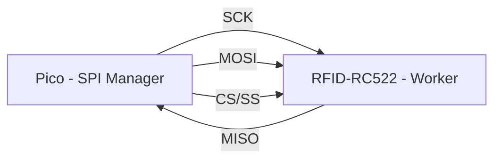
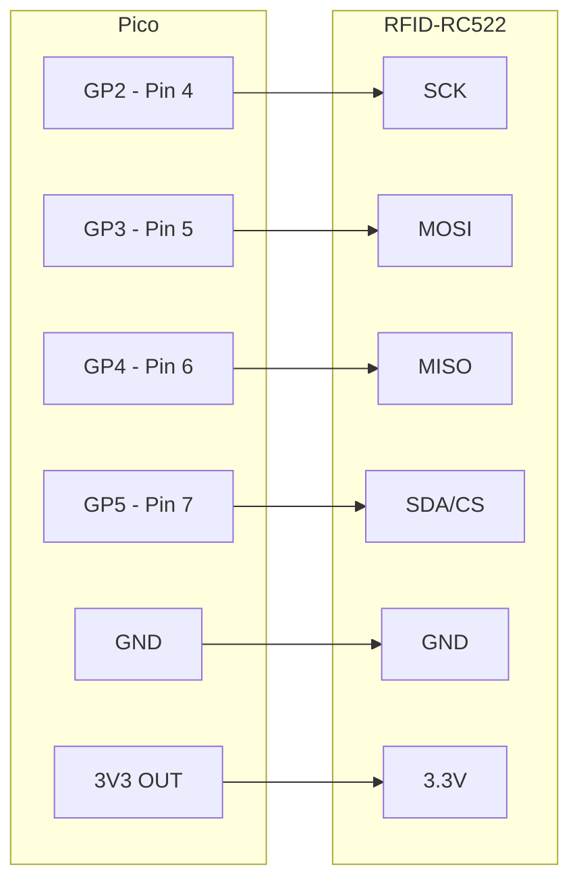
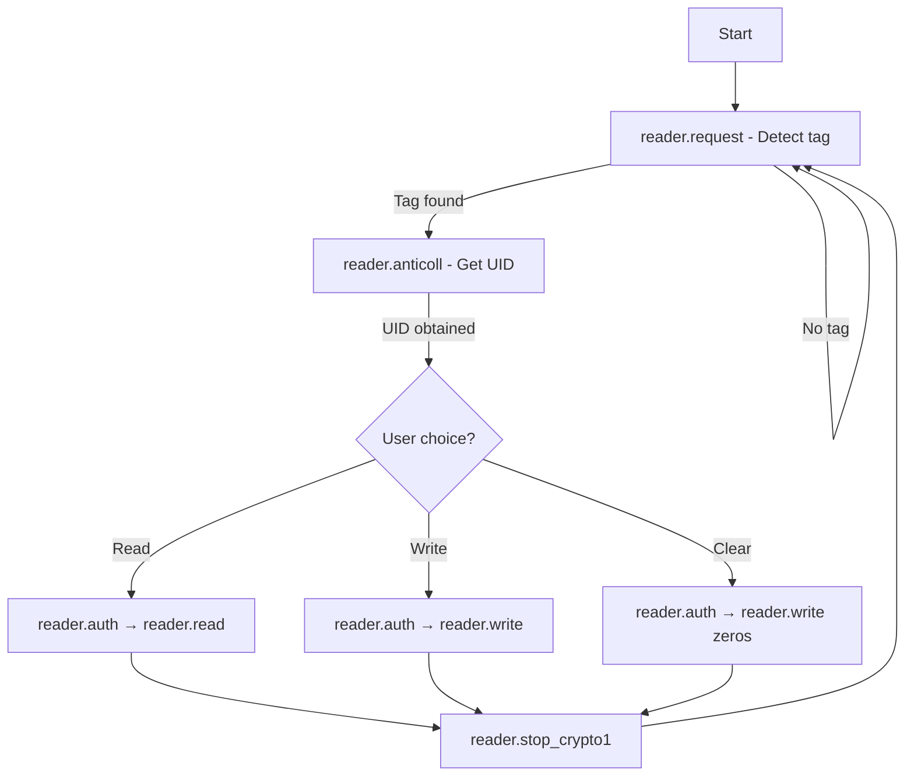

---
tags:
  - practical-computing
  - lab6
  - SPI
  - RFID
  - Pico
  - MicroPython
  - communications
date: 2026-03-03
module: Practical Computing
lab: 6
title: "Communications: SPI & RFID"
---

# Lab 6: Communications – SPI & RFID


## 1. Technology Overview

### 1.1 SPI (Serial Peripheral Interface)

> [!info] What is SPI?
> SPI is a **synchronous, serial communication protocol** designed for **short-distance, high-speed** data transfer between a **manager** (master) and one or more **worker** (slave) devices.

#### Key Characteristics

| Property            | Detail                                                                 |
| ------------------- | ---------------------------------------------------------------------- |
| **Type**            | Serial (one bit at a time per data line)                               |
| **Directionality**  | Full-duplex (simultaneous TX and RX on separate wires)                 |
| **Synchronisation** | Synchronous – a shared clock signal (SCK) coordinates bit timing      |
| **Topology**        | One manager, many workers; each worker has its own Chip Select (CS/SS) |

#### The Four SPI Signals

| Signal     | Full Name              | Direction        | Purpose                                          |
| ---------- | ---------------------- | ---------------- | ------------------------------------------------ |
| **SCK**    | Serial Clock           | Manager → Worker | Clock signal that synchronises data transfer     |
| **MOSI**   | Manager Out, Worker In | Manager → Worker | Data sent **from** the Pico **to** the module    |
| **MISO**   | Manager In, Worker Out | Worker → Manager | Data sent **from** the module **to** the Pico    |
| **CS/SS**  | Chip Select            | Manager → Worker | Active-low; pulled LOW to select a worker device |

#### SPI Bus Topology



> [!note] RP2040 SPI Ports
> The RP2040 MCU on the Pico has **two hardware SPI ports**: `SPI0` and `SPI1`. This lab uses **SPI0** (pins `GP2`–`GP5`). However, the code uses **`SoftSPI`** (bit-banged software implementation), which allows flexible pin assignment and is fast enough at 100 kbps.

![[Pasted image 20260303101236.png]]

#### SPI Polarity & Phase (CPOL / CPHA)

| Setting              | Value | Meaning                                                            |
| -------------------- | ----- | ------------------------------------------------------------------ |
| `polarity=1` (CPOL=1)| Clock idles **HIGH** | When idle, SCK stays at 3.3 V                        |
| `phase=0` (CPHA=0)   | Sample on **leading edge** | Data is read on clock's first transition (HIGH→LOW) |

> [!tip]
> The MFRC522 datasheet specifies **CPOL=1, CPHA=0**, so `polarity=1, phase=0` is the correct configuration.

---

### 1.2 RFID (Radio-Frequency IDentification)

> [!info] What is RFID?
> RFID is a **wireless protocol** that uses radio waves to identify and track tags. The "tap-style" contactless variant operates at **13.56 MHz**.

| Property         | Detail                                                                |
| ---------------- | --------------------------------------------------------------------- |
| **Frequency**    | 13.56 MHz (NFC / contactless band)                                    |
| **Module**       | MFRC522 (RFID-RC522 breakout board)                                   |
| **Tag standard** | MIFARE Classic 1K (Mifare1 S50)                                       |
| **Range**        | A few centimetres (tag must be very close to the coil)                |
| **Power**        | Tag has **no battery**; it harvests energy from the reader's EM field |

#### Mifare1 S50 Tag Memory Structure

| Feature          | Value                                          |
| ---------------- | ---------------------------------------------- |
| **UID**          | 4-byte globally unique identifier (read-only, factory-set) |
| **Total storage**| 1 KB (1024 bytes)                              |
| **Organisation** | 16 sectors × 4 blocks × 16 bytes              |
| **Read cycles**  | Unlimited                                      |
| **Write cycles** | ~100,000 (writes degrade internal flash)       |
| **Data retention**| ~10 years                                     |
| **Security**     | Each sector is password-protected (default: `0xFF × 6`) |

> [!warning] Password Recovery
> If you change the authentication key and **forget it**, the sector becomes **permanently read-only**. There is **no recovery mechanism**.

---

## 2. Task 1 – Wiring the RFID-RC522 to the Pico

### 2.1 Pin Mapping

| RFID-RC522 Pin | Pico GPIO | Pico Physical Pin | SPI Role                |
| -------------- | --------- | ----------------- | ----------------------- |
| **SDA**        | **GP5**   | Pin 7             | Chip Select (CS/SS)     |
| **SCK**        | **GP2**   | Pin 4             | SPI Clock               |
| **MOSI**       | **GP3**   | Pin 5             | Manager Out, Worker In  |
| **MISO**       | **GP4**   | Pin 6             | Manager In, Worker Out  |
| **GND**        | —         | Any GND           | Ground reference        |
| **3.3V**       | —         | 3V3(OUT)          | Power supply            |
| **RST**        | —         | *Not connected*   | Hardware reset          |
| **IRQ**        | —         | *Not connected*   | Interrupt (not used)    |

> [!danger] Voltage Warning
> The RFID-RC522 module runs at **3.3 V only**. ==Never connect it to 5 V== – it will be damaged.

> [!tip] SDA Pin Confusion
> The module's **SDA** pin is labelled that way because the module also supports I²C. In SPI mode, this pin functions as the **Chip Select (CS/SS)**.

### 2.2 Wiring Diagram (Logical)



### 2.3 Wiring Checklist

- [ ] Use **6 female-to-male jumper wires**
- [ ] SDA → GP5
- [ ] SCK → GP2
- [ ] MOSI → GP3
- [ ] MISO → GP4
- [ ] GND → GND
- [ ] 3.3V → 3V3(OUT)
- [ ] Double-check every connection before powering on

---

![[Pasted image 20260303101605.png]]

## 3. Task 1 – Code Setup

### 3.1 Required Files

| File             | Location                              | Purpose                              |
| ---------------- | ------------------------------------- | ------------------------------------ |
| `RFIDreader.py`  | Runs from your PC (Thonny uploads it) | Main program                         |
| `mfrc522.py`     | **Must be uploaded to the Pico**      | Driver library for the MFRC522 chip  |

### 3.2 Uploading the Library to the Pico

> [!abstract] Steps
> 1. In Thonny → **View** → **Files** (opens the sidebar)
> 2. Top panel = your PC's filesystem; bottom panel = Pico's filesystem
> 3. Navigate to `mfrc522.py` in the top panel
> 4. Right-click → **"Upload to /"**
> 5. The file is now stored on the Pico's flash and will persist until manually deleted

### 3.3 Code Walkthrough

#### Imports

```python
from machine import Pin, SoftSPI      # SoftSPI = software (bit-banged) SPI
from time import sleep
from mfrc522 import MFRC522           # High-level RFID driver (lives on Pico)
```

> [!note] Why a dedicated library?
> Complex SPI/I²C modules require specific sequences of low-level register reads and writes. The `mfrc522` library abstracts all of this into simple high-level function calls like `request()`, `anticoll()`, `read()`, and `write()`.

#### SPI & Reader Initialisation

```python
# Pin objects – all configured as outputs from the manager's perspective
ChipSelect = Pin(5, Pin.OUT)          # CS / SS  → RFID module's SDA pin
Clock      = Pin(2, Pin.OUT)          # SCK      → RFID module's SCK pin
MOSI       = Pin(3, Pin.OUT)          # MOSI     → RFID module's MOSI pin
MISO       = Pin(4, Pin.OUT)          # MISO     → RFID module's MISO pin

# Create a SoftSPI bus
#   baudrate  = 100 kbps (safe for short jumper wires)
#   polarity  = 1  → clock idles HIGH
#   phase     = 0  → data sampled on the first (leading) clock edge
spi = SoftSPI(baudrate=100000, polarity=1, phase=0,
              sck=Clock, mosi=MOSI, miso=MISO)

# Instantiate the MFRC522 driver
reader = MFRC522(spi, ChipSelect)
```

#### Default Authentication Key

```python
# Factory default: 6 bytes of 0xFF
key = [0xFF, 0xFF, 0xFF, 0xFF, 0xFF, 0xFF]
```

> [!warning]
> In a real application you would change this key to protect data. But if the key is lost, the sector becomes **permanently read-only**.

### Complete Code:

```python
from machine import Pin, SoftSPI
from time import sleep
import sys
from mfrc522 import MFRC522 # Dedicated library

# Our MCU is SPI master, tag reader is slave

ChipSelect = Pin(5, Pin.OUT) #chip select for the tag reader worker

Clock = Pin(2, Pin.OUT) # SPI clock
MOSI = Pin(3, Pin.OUT) # Manager out, worker in
MISO = Pin(4, Pin.OUT) # Manager in, worker out
spi = SoftSPI(baudrate=100000, polarity=1, phase=0, sck=Clock, mosi=MOSI, miso=MISO)

reader = MFRC522(spi, ChipSelect)

key = [0xFF, 0xFF, 0xFF, 0xFF, 0xFF, 0xFF] #default key

def main_menu(): #user_choice):

    print("Main Menu")
    print("-"*9)
    print("1: Read the card data")
    print("2: Write data to the card")
    print("3: Clear data in card")
    print("7: Exit or Ctrl + C")

    user_choice = input("Input option: ")
    print("")

    return user_choice
try:

    option = main_menu()
    if option == "7":

        reader.stop_crypto1()
        print("Exiting program...")
        sys.exit("Exiting program...")

    elif option == "2":

        the_data = input("Please input data: ")
    print("Present tag ...")

    status = reader.ERR

    while status !=reader.OK:

        (status, tag_type) = reader.request(reader.CARD_REQIDL) #Read the card type number

    print('Found a tag!')

    print('  - Tag Type: 0x%02x' % tag_type)

    sleep(0.5)  

    (status, raw_uid) = reader.anticoll() #Reads the card serial number of the selected card

    if status != reader.OK:

        print("Can't read tag ID!")

        sys.exit("Can't read tag ID!")

    print('  - Tag uid: 0x%02x%02x%02x%02x' % (raw_uid[0], raw_uid[1], raw_uid[2], raw_uid[3]))      

    print('')

    sleep(0.5)

    if reader.select_tag(raw_uid) != reader.OK: #Select that tag to work with

        print("Failed to select tag!")

        sys.exit("Failed to select tag!")

    if option == "1":

        print("Reading data ...")

        print('  - using key: ' , key)

        print('  - uid: 0x%02x%02x%02x%02x' % (raw_uid[0], raw_uid[1], raw_uid[2], raw_uid[3]))

        reader.Read_Data(key, raw_uid)

    elif option == "2":

        print("Writing data ...")

        print('  - using key: ' , key)

        print('  - uid: 0x%02x%02x%02x%02x' % (raw_uid[0], raw_uid[1], raw_uid[2], raw_uid[3]))

        reader.Write_Data(key, raw_uid, the_data)

    elif option == "3":

        print("Clearing data ...")

        print('  - using key: ' , key)

        print('  - uid: 0x%02x%02x%02x%02x' % (raw_uid[0], raw_uid[1], raw_uid[2], raw_uid[3]))

        reader.Clear_Data(key, raw_uid)

    else:

        print("Menu choice error")

        print("")

except KeyboardInterrupt:

    print("Keyboard exit!")

```
---

## 4. Task 2 – Reading, Writing & Clearing the Tag

### 4.1 Menu Options

When you run `RFIDreader.py`, a 3-option menu appears:

| Option       | Action                                | Notes                                                     |
| ------------ | ------------------------------------- | --------------------------------------------------------- |
| **1. Read**  | Reads data from a sector/block        | Quick for UID; data read requires tag to stay steady       |
| **2. Write** | Writes a short string to a block      | Characters are converted to bytes and written              |
| **3. Clear** | Overwrites a block with zeros         | Effectively erases stored data                             |

### 4.2 Key Library Methods

```python
# ─── DETECT THE TAG ──────────────────────────
(status, tag_type) = reader.request(reader.REQIDL)
# status   → success / failure
# tag_type → 0x10 for Mifare1 S50

# ─── GET THE UNIQUE ID ──────────────────────
(status, raw_uid) = reader.anticoll()
# raw_uid → list of 4 bytes, e.g. [0xA3, 0x4B, 0x7C, 0x01]

# ─── AUTHENTICATE A SECTOR ──────────────────
status = reader.auth(reader.AUTHENT1A, block_address, key, raw_uid)

# ─── READ A BLOCK (16 bytes) ────────────────
data = reader.read(block_address)

# ─── WRITE A BLOCK (16 bytes) ───────────────
reader.write(block_address, data_list)   # data_list must be exactly 16 bytes

# ─── STOP COMMUNICATION ─────────────────────
reader.stop_crypto1()
```

### 4.3 Operation Flow



### 4.4 Practical Tips

> [!tip] Holding the Fob
> - **UID reads** are fast and rarely fail (tiny energy needed)
> - **Data reads/writes** are slow — hold the fob **flat and steady** against the antenna for 2–3 seconds
> - If the fob moves during a write, the operation aborts

> [!important] Error Handling
> Always wrap read/write attempts in `try/except` or check status codes. The tag can lose power at any moment, and a crash in your code could leave the tag in an inconsistent state.

---

## 5. Optional Task – Electronic Lock (Access Control)

### 5.1 Concept

| Condition                        | Action                               |
| -------------------------------- | ------------------------------------ |
| **Correct fob** (UID matches)    | Turn on ==green LED== → "unlocked"   |
| **Wrong fob** (UID doesn't match)| Turn on ==red LED== → "access denied"|

### 5.2 Additional Wiring

| Component                  | Pico GPIO | Pico Physical Pin | Detail                          |
| -------------------------- | --------- | ----------------- | ------------------------------- |
| Green LED + 220 Ω resistor| **GP15**  | Pin 20            | Anode → resistor → GP15; Cathode → GND |
| Red LED + 220 Ω resistor  | **GP14**  | Pin 19            | Anode → resistor → GP14; Cathode → GND |

### 5.3 Example Code

```python
from machine import Pin, SoftSPI
from time import sleep
from mfrc522 import MFRC522

# ── SPI & READER SETUP ──────────────────────────────
ChipSelect = Pin(5, Pin.OUT)
Clock      = Pin(2, Pin.OUT)
MOSI       = Pin(3, Pin.OUT)
MISO       = Pin(4, Pin.OUT)

spi = SoftSPI(baudrate=100000, polarity=1, phase=0,
              sck=Clock, mosi=MOSI, miso=MISO)
reader = MFRC522(spi, ChipSelect)

# ── LED SETUP ───────────────────────────────────────
green_led = Pin(15, Pin.OUT)
red_led   = Pin(14, Pin.OUT)

# ── AUTHORISED UID ──────────────────────────────────
# Replace with YOUR fob's UID (read it first using Task 2)
AUTHORISED_UID = [0xA3, 0x4B, 0x7C, 0x01]   # example only!

# ── MAIN LOOP ──────────────────────────────────────
print("Electronic Lock – present your key fob...")

while True:
    green_led.value(0)
    red_led.value(0)

    (status, tag_type) = reader.request(reader.REQIDL)

    if status == reader.OK:
        (status, raw_uid) = reader.anticoll()

        if status == reader.OK:
            uid = list(raw_uid[:4])
            print("Tag detected – UID:", [hex(b) for b in uid])

            if uid == AUTHORISED_UID:
                print("✅ ACCESS GRANTED")
                green_led.value(1)
            else:
                print("🚫 ACCESS DENIED")
                red_led.value(1)

            sleep(2)   # Keep LED on for 2 seconds

    sleep(0.3)   # Small delay to avoid hammering the reader
```

### 5.4 How It Works

1. **`reader.request(reader.REQIDL)`** — sends a "wake up" into the EM field; if a tag is present, it responds with its **tag type** (`0x10`)
2. **`reader.anticoll()`** — performs **anti-collision**, selects a tag, and returns its 4-byte **UID**
3. The UID is compared against `AUTHORISED_UID`
4. The appropriate LED turns on for 2 seconds, then the loop resets

### 5.5 Real-World Extensions

| Extension                    | How                                                              |
| ---------------------------- | ---------------------------------------------------------------- |
| **Electromechanical latch**  | Transistor driver → relay / solenoid (as in Lab 4)               |
| **Buzzer alert**             | Piezo buzzer driven via transistor on access denied               |
| **IoT Cloud integration**   | Send lock/unlock events to the cloud; mobile dashboard           |
| **Multiple authorised fobs** | Store UIDs in a list: `if uid in AUTHORISED_LIST`               |

---

## 6. Complete Pin Map (Quick Reference)

| Pico GPIO | Pico Physical Pin | Connected To               | Role                     |
| --------- | ----------------- | -------------------------- | ------------------------ |
| GP2       | Pin 4             | RFID SCK                   | SPI Clock                |
| GP3       | Pin 5             | RFID MOSI                  | Data: Pico → RFID        |
| GP4       | Pin 6             | RFID MISO                  | Data: RFID ��� Pico        |
| GP5       | Pin 7             | RFID SDA (CS)              | Chip Select              |
| —         | 3V3(OUT)          | RFID 3.3V                  | Power                    |
| —         | Any GND           | RFID GND                   | Ground                   |
| GP15      | Pin 20            | Green LED (via 220 Ω)      | Access granted indicator |
| GP14      | Pin 19            | Red LED (via 220 Ω)        | Access denied indicator  |

---

## 7. Troubleshooting

> [!bug] No tag detected at all
> **Cause:** Wiring error (especially SDA/SCK swapped)
> **Fix:** Re-check every connection against the pin table above

> [!bug] `ImportError: no module named 'mfrc522'`
> **Cause:** Library not uploaded to the Pico
> **Fix:** Thonny → Files sidebar → right-click `mfrc522.py` → "Upload to /"

> [!bug] UID reads fine but data read/write fails
> **Cause:** Fob moved away too quickly; not enough energy
> **Fix:** Hold the fob **flat and steady** against the antenna for 2–3 seconds

> [!bug] Writes succeed but data reads back as zeros
> **Cause:** Authentication failed silently
> **Fix:** Ensure the `key` list matches the sector's actual password

> [!bug] Module gets warm
> **Cause:** Connected to 5 V instead of 3.3 V
> **Fix:** ==Disconnect immediately==; use the 3V3(OUT) pin only

---

## 8. Key Terminology Glossary

| Term               | Definition                                                                                     |
| ------------------ | ---------------------------------------------------------------------------------------------- |
| **SPI**            | Serial Peripheral Interface – synchronous, full-duplex serial protocol                         |
| **Manager/Master** | The device that controls the clock and initiates communication (Pico)                          |
| **Worker/Slave**   | A peripheral device that responds to the manager (RFID module)                                 |
| **MOSI**           | Manager Out, Worker In – data line from Pico to peripheral                                     |
| **MISO**           | Manager In, Worker Out – data line from peripheral to Pico                                     |
| **CS/SS**          | Chip Select / Slave Select – active-low signal to select a worker                              |
| **SCK**            | Serial Clock – shared clock signal                                                             |
| **RFID**           | Radio-Frequency IDentification – wireless identification via radio waves                       |
| **MIFARE**         | NXP's family of contactless smart card ICs (the tag standard used here)                        |
| **UID**            | Unique Identifier – 4-byte factory-set, read-only tag ID                                       |
| **SoftSPI**        | Software (bit-banged) SPI implementation in MicroPython                                        |
| **Anti-collision** | Protocol to select one tag when multiple are in the EM field simultaneously                    |
| **Baudrate**       | Data transfer speed in bits per second (100,000 bps = 100 kbps here)                           |

---

## 9. Lab Materials Checklist

- [ ] Raspberry Pi Pico mounted in a breadboard + USB cable
- [ ] RFID-RC522 module
- [ ] RFID key fob
- [ ] 6 × Female-to-male jumper wires
- [ ] 2 × 220 Ω resistors
- [ ] 2 × LEDs (green, red)

---

> [!quote] Lab Insight
> *"Once we learn how to communicate the Pico with the IoT Cloud, the green/red activations could also be sent 'up there' and used with a mobile app dashboard, so you know when someone opens (or tries to open) your door. This is just an example — your imagination is the limit!"*
> — Lab 6 Handout