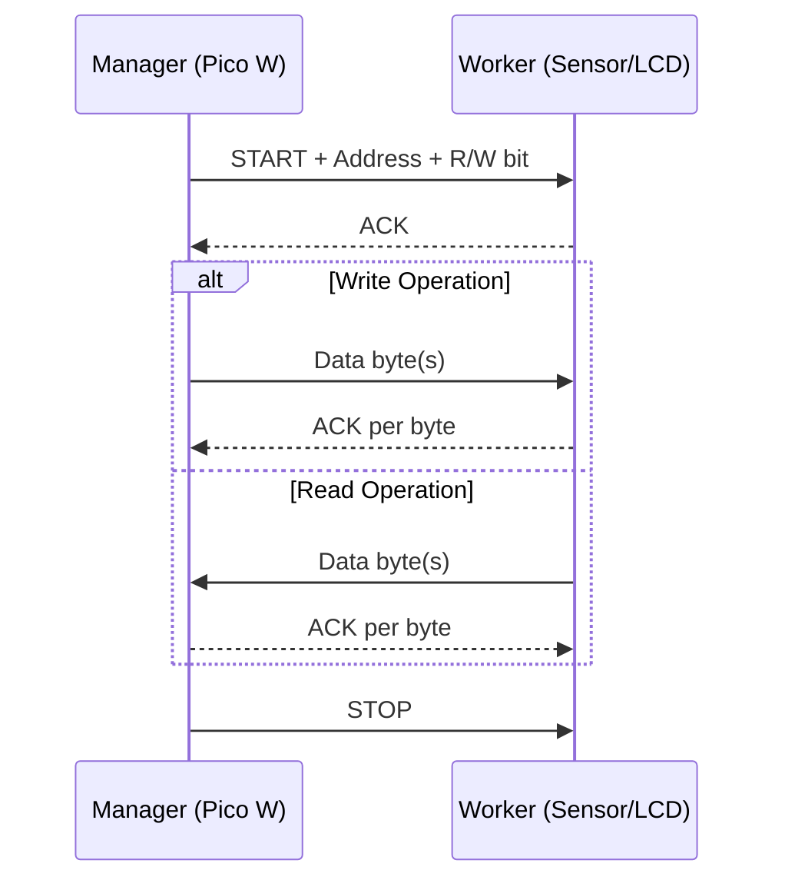

# 🧪 Lab 7: I2C Sensors & LCD Screen


---

## 🧠 Core Concepts

### What is I2C?

> **Inter-Integrated Circuit (I²C)** is a synchronous, multi-device communication protocol using only **2 signal lines** (plus power and ground).

| Line | Name | Purpose |
|------|------|---------|
| **SDA** | Serial Data | Bidirectional data transfer (half-duplex) |
| **SCL** | Serial Clock | Clock signal generated by the Manager device |
| **VCC** | Supply | Power (3.3V or 5V depending on device) |
| **GND** | Ground | Common ground reference |

#### Key Properties

- **Synchronous** — clock signal synchronises all data transfer
- **Shared bus** — multiple devices on the same 2 wires
- **Manager/Worker** architecture (formerly Master/Slave)
- Each device has a unique **7-bit I2C address** (0–127)
- **Pull-up resistors** required on SDA and SCL (often built into breakout boards)

#### Addressing Rules

> [!important]
> Two devices with the **same I2C address** cannot share the same bus.
> They must be connected to **different I2C bus instances**.

Some devices offer address selection via a jumper or solder pad (e.g., choosing between `0x68` and `0x69`).

### I2C Transaction Flow

```
1. Manager sends START condition (SDA goes LOW while SCL is HIGH)
2. Manager sends 7-bit address + 1-bit R/W flag (8 bits total)
3. Addressed Worker sends ACK
4. Data transfer occurs:
   - WRITE: Manager → Worker (Worker ACKs each byte)
   - READ:  Worker → Manager (Manager ACKs each byte)
5. Manager sends STOP condition (SDA goes HIGH while SCL is HIGH)
```



---

## 🔌 The Raspberry Pi Pico W

### Pico vs Pico W — Key Differences

| Feature | Pico | Pico W |
|---------|------|--------|
| MCU | RP2040 | RP2040 |
| Wi-Fi | ❌ | ✅ (Infineon CYW43439) |
| Onboard LED Pin | `GP25` | Routed through Wi-Fi chip |
| LED Code | `Pin(25, Pin.OUT)` | `Pin("LED", Pin.OUT)` |

> [!warning]
> The **only code change** you need for Pico W is the LED initialisation:
> ```python
> # Pico (original)
> led = Pin(25, Pin.OUT)
>
> # Pico W
> led = Pin("LED", Pin.OUT)
> ```

---

## 📋 Task 1: MPU6050 Inertial Motion Unit (IMU)

### 1.1 About the MPU6050

The MPU6050 is a **6-axis IMU** containing:

| Sensor | Measures | Unit | Axes |
|--------|----------|------|------|
| **Accelerometer** | Linear acceleration | g (9.8 m/s²) | X, Y, Z |
| **Gyroscope** | Angular velocity | rad/s (~57°/s) | X, Y, Z |
| **Temperature** | Chip temperature | °C | — |

- **I2C Address:** `104` (`0x68`) — hardcoded by manufacturer
- **Supply:** 5V (on-board regulator converts to 3.3V internally)
- **Pull-up resistors:** Built into the breakout board ✅

#### Axis Orientation

```
        Z (up)
        |
        |
        +------ Y (right)
       /
      /
    X (forward)
```

> [!tip]
> At rest on a flat surface:
> - `ax ≈ 0g`, `ay ≈ 0g`, `az ≈ 1g` (gravity acts along Z)
> - Tilting shifts gravity contribution across axes

### 1.2 Wiring

| MPU6050 Pin | Pico W Pin | Notes |
|-------------|------------|-------|
| VCC | VBUS (5V) | Must supply 5V (internal regulator) |
| GND | Any GND | Common ground |
| SDA | GP8 | I2C Bus 0, SDA |
| SCL | GP9 | I2C Bus 0, SCL |

### 1.3 Required Libraries

Upload these to the Pico's internal storage via Thonny:

1. `imu.py` — MPU6050 driver (contains hardcoded address `0x68`)
2. `vector3d.py` — dependency for 3D vector representation

### 1.4 Code: Reading the MPU6050

```python
from machine import Pin, I2C
from imu import MPU6050
from time import sleep

# --- LED setup (Pico W) ---
LED = Pin("LED", Pin.OUT)
LED.on()

# --- I2C bus 0 setup ---
i2c = I2C(0, scl=Pin(9), sda=Pin(8), freq=400000)

# --- Scan for devices on the bus ---
I2C_ADDR = i2c.scan()
print("Devices found:", I2C_ADDR)  # Should show [104] i.e. 0x68

# --- Initialise IMU ---
imu = MPU6050(i2c)

# --- Main loop: read and display ---
while True:
    ax = round(imu.accel.x, 2)
    ay = round(imu.accel.y, 2)
    az = round(imu.accel.z, 2)
    gx = round(imu.gyro.x, 2)
    gy = round(imu.gyro.y, 2)
    gz = round(imu.gyro.z, 2)
    tem = round(imu.temperature, 1)

    print(
        "ax:%.1f" % ax + " ay:%.1f" % ay + " az:%.1f" % az +
        "\t gx:%.1f" % gx + " gy:%.1f" % gy + " gz:%.1f" % gz +
        "\t Temperature:%.1f" % tem + "C ",
        end="\r"  # Overwrite same line
    )
    sleep(0.2)
```

#### Key Observations

| Scenario | Expected Readings |
|----------|------------------|
| Flat on table | ax≈0, ay≈0, az≈1g |
| Tilted 90° on side | One axis ≈ 1g, Z ≈ 0g |
| Rotating | Gyro values become non-zero |
| Stationary | Gyro values ≈ 0 rad/s |

> [!note] **Real-world application**
> Your smartphone uses the same type of sensor for screen rotation, step counting, gesture detection, gaming controls, and navigation.

---

## 📋 Task 2: LCD1602 Screen

### 2.1 About the LCD1602

| Property | Value |
|----------|-------|
| Display | 2 rows × 16 characters |
| Interface | I2C (via PCF8574 backpack) |
| I2C Address | `63` (`0x3F`) |
| Pull-up resistors | Built-in ✅ |
| Power consumption | Relatively high (backlight) |

> [!warning] Overflow behaviour
> Writing past character 16 on row 2 **wraps back** to the beginning of row 1.

### 2.2 Wiring

Since the LCD uses a **different I2C address** (`0x3F`) than the IMU (`0x68`), both can share the **same I2C bus**.

| LCD1602 Pin | Pico W Pin | Notes |
|-------------|------------|-------|
| VCC | VBUS (5V) | Power supply |
| GND | Any GND | Common ground |
| SDA | GP8 | Same as IMU — shared bus |
| SCL | GP9 | Same as IMU — shared bus |

### 2.3 Required Libraries

Upload to Pico via Thonny:

1. `pico_i2c_lcd.py` — LCD communication driver
2. `lcd_api.py` — base LCD API (dependency)

### 2.4 Timer Interrupts & Callbacks

#### Why Not Use `while True` + `sleep()`?

| Approach | CPU State During Wait | Energy |
|----------|----------------------|--------|
| `while True` + `sleep()` | **Active wait** — CPU busy checking timer | 🔴 High |
| `Timer` + `callback` | **Idle** — MicroPython interpreter inactive between callbacks | 🟢 Low |
| `machine.lightsleep(t)` | **Sleeping** — CPU in low-power mode | 🟢🟢 Very Low |

> [!important]
> `machine.lightsleep()` breaks Thonny's connection to the Pico, so we use the Timer approach in this lab. In production (without Thonny), `lightsleep` would be preferred.

#### How Timers Work

```
Time (ticks) × Clock Period (T_CLK) = Actual Time

Example: 1000 ticks × (1 / 100MHz) = 10 µs
```

The timer hardware counts clock edges independently of the CPU. When the count reaches the target, it fires an **interrupt** that:
1. Pauses current execution
2. Runs the **callback function**
3. Resumes (or stays idle)

#### Timer API

```python
from machine import Timer

sensor_timer = Timer()
sensor_timer.init(
    period=3000,            # milliseconds between callbacks
    mode=Timer.PERIODIC,    # repeat indefinitely
    callback=my_function    # function to call (receives timer object as arg)
)
```

> [!note]
> The callback function **must** accept one argument: the timer object that triggered it.
> ```python
> def my_function(timer):  # 'timer' parameter is required
>     pass
> ```

### 2.5 Code: LCD with Timer Callback

```python
from machine import Pin, Timer, I2C
from pico_i2c_lcd import I2cLcd
from utime import sleep

# --- I2C and LCD setup ---
LCD_I2C_ADDR = 63  # 0x3F
i2c = I2C(0, scl=Pin(9), sda=Pin(8), freq=400000)
lcd = I2cLcd(i2c, LCD_I2C_ADDR, 2, 16)  # 2 rows, 16 columns

# --- Simulated sensor data ---
temperature = 10
humidity = 40

# --- Display static labels ONCE (saves power & time) ---
lcd.move_to(0, 0)   # Column 0, Row 0
lcd.putstr("Temp: ")
lcd.move_to(0, 1)   # Column 0, Row 1
lcd.putstr("Humidity: ")

# --- Callback: update only the changing data ---
def getData(currentTime):
    global temperature, humidity

    lcd.move_to(6, 0)           # After "Temp: "
    lcd.putstr("%2.1f" % temperature)
    lcd.putstr("C")

    lcd.move_to(10, 1)          # After "Humidity: "
    lcd.putstr("%2.1f" % humidity)
    lcd.putstr("%")

    temperature += 1
    humidity -= 2

# --- Set up periodic timer (every 3 seconds) ---
sensor_timer = Timer()
sensor_timer.init(period=3000, mode=Timer.PERIODIC, callback=getData)

# Program "ends" here but timer keeps firing callbacks!
```

#### LCD Power Optimisation Strategy

```
┌─────────────────────────────┐
│ Write static text ONCE      │ ← "Temp: ", "Humidity: "
│ (outside callback)          │
├─────────────────────────────┤
│ Update ONLY dynamic data    │ ← Values that change
│ (inside callback)           │
├─────────────────────────────┤
│ Minimise LCD writes         │ ← LCD I2C writes are slow
│                             │    and power-hungry
└─────────────────────────────┘
```

---

## 📋 Task 3: IMU Data on LCD

### Design Considerations

| Constraint | Impact |
|-----------|--------|
| 16 chars × 2 rows only | Must abbreviate labels |
| LCD refresh is slow | Can't update as fast as terminal (use longer timer period) |
| Power consumption | Use Timer callback, minimise writes |

### Example Layout

```
┌────────────────┐
│AX:0.0 AY:0.0  │  Row 0: Accelerometer X and Y
│AZ:1.0 T:23.5C │  Row 1: Accelerometer Z and Temperature
└────────────────┘
```

### Example Combined Code

```python
from machine import Pin, Timer, I2C
from imu import MPU6050
from pico_i2c_lcd import I2cLcd

# --- I2C bus (shared by both devices) ---
i2c = I2C(0, scl=Pin(9), sda=Pin(8), freq=400000)

# --- Devices ---
imu = MPU6050(i2c)                        # Address 0x68
lcd = I2cLcd(i2c, 63, 2, 16)              # Address 0x3F

# --- Static labels ---
lcd.move_to(0, 0)
lcd.putstr("AX:    AY:")
lcd.move_to(0, 1)
lcd.putstr("AZ:    T:")

# --- Callback: read IMU → update LCD ---
def updateDisplay(timer):
    ax = round(imu.accel.x, 1)
    ay = round(imu.accel.y, 1)
    az = round(imu.accel.z, 1)
    temp = round(imu.temperature, 1)

    lcd.move_to(3, 0)
    lcd.putstr("%-4s" % str(ax))   # Left-align, pad to 4 chars

    lcd.move_to(11, 0)
    lcd.putstr("%-4s" % str(ay))

    lcd.move_to(3, 1)
    lcd.putstr("%-4s" % str(az))

    lcd.move_to(10, 1)
    lcd.putstr("%-5s" % str(temp))

# --- Timer: update every 1 second ---
timer = Timer()
timer.init(period=1000, mode=Timer.PERIODIC, callback=updateDisplay)
```

---

## 🔧 Optional Tasks

### Optional 1: Explore `lcd_api.py`

Useful functions found in the library:

| Method | Description |
|--------|-------------|
| `lcd.clear()` | Clear entire display |
| `lcd.backlight_on()` | Turn backlight on |
| `lcd.backlight_off()` | Turn backlight off (saves power!) |
| `lcd.display_on()` | Enable display |
| `lcd.display_off()` | Disable display |
| `lcd.show_cursor()` | Show blinking cursor |
| `lcd.hide_cursor()` | Hide cursor |
| `lcd.blink_cursor_on()` | Blinking block cursor |
| `lcd.blink_cursor_off()` | Stop cursor blink |
| `lcd.move_to(col, row)` | Position cursor at column, row |
| `lcd.putstr(string)` | Write string at current position |

### Optional 2: Real Time Clock (RTC)

```python
from machine import RTC

rtc = RTC()

# Set the date/time: (year, month, day, weekday, hour, minute, second, subsecond)
rtc.datetime((2026, 3, 10, 1, 14, 30, 0, 0))

# Read current time
now = rtc.datetime()
print("Date: %d-%02d-%02d" % (now[0], now[1], now[2]))
print("Time: %02d:%02d:%02d" % (now[4], now[5], now[6]))
```

> [!warning] **Caveat**
> The Pico's RTC resets on power loss — there is no battery backup. You must set the time at each startup (manually, via Thonny, or by syncing with an NTP server over Wi-Fi).

#### Display Time on LCD

```python
def showTime(timer):
    now = rtc.datetime()
    lcd.move_to(0, 0)
    lcd.putstr("%02d:%02d:%02d" % (now[4], now[5], now[6]))
```

---

## 📚 Summary: All Libraries Needed

| Library | Purpose | Dependency |
|---------|---------|------------|
| `imu.py` | MPU6050 I2C driver | `vector3d.py` |
| `vector3d.py` | 3D vector math | — |
| `pico_i2c_lcd.py` | LCD1602 I2C driver | `lcd_api.py` |
| `lcd_api.py` | Generic LCD API | — |

> Upload all 4 files to the Pico's internal storage via **Thonny** before running any code.

---

## 📐 Complete Wiring Diagram (All Devices)

```
Pico W              MPU6050          LCD1602
──────              ───────          ───────
VBUS (5V) ────────── VCC ──────────── VCC
GND ──────────────── GND ──────────── GND
GP8 (SDA) ────────── SDA ──────────── SDA
GP9 (SCL) ────────── SCL ──────────── SCL

I2C Bus 0:
  ├── MPU6050  @ address 0x68 (104)
  └── LCD1602  @ address 0x3F  (63)
```

---

## 🧩 Key Takeaways

1. **I2C** uses just 2 wires (SDA + SCL) for multi-device communication
2. Each device has a **unique address** — no duplicates on the same bus
3. **Timer interrupts** are far more energy-efficient than `while True` + `sleep()`
4. **Minimise LCD writes** — write static text once, update only dynamic data
5. The **Pico W** is pin-compatible with the Pico, except the onboard LED uses `Pin("LED")`
6. Both MPU6050 (`0x68`) and LCD1602 (`0x3F`) can share the same I2C bus since they have different addresses

---

## 🏷️ Tags

#embedded #raspberrypi #pico-w #i2c #mpu6050 #lcd1602 #micropython #timer #interrupts #iot #sensors