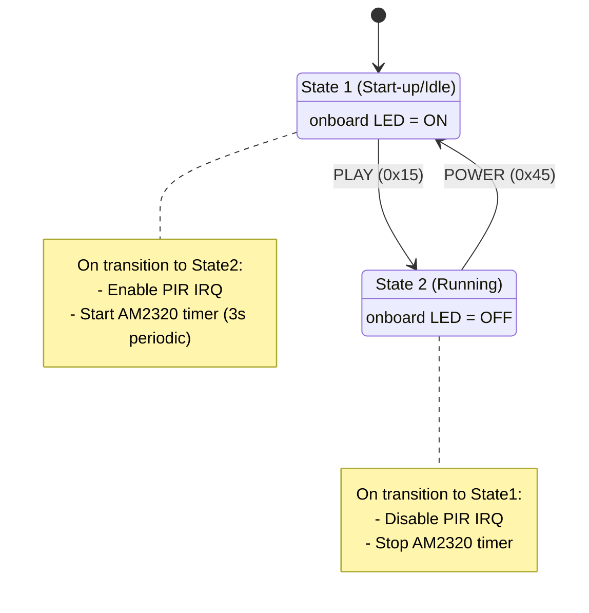

# Lab 8: Integrating Multiple Devices (State Diagram)
## 1) Why this lab matters

> [!info]
> In embedded/IoT systems, we usually do **event-driven** programming rather than constantly polling everything in a big loop.

This lab combines 3 core techniques:

1. **Interrupts** → react immediately when events happen  
2. **Timers** → run tasks periodically or after delays  
3. **FSM** → keep code organized and scalable using states/transitions

---

## 2) Core concepts

## 2.1 Interrupts

An interrupt is a hardware-triggered mechanism that temporarily diverts CPU execution to a callback (handler function).

Examples:
- Input pin change (e.g., PIR output goes HIGH)
- Timer reaches period
- Communication peripheral receives data

> [!tip]
> Interrupts let your CPU sleep/do other work instead of constantly checking sensors.

---

## 2.2 Timers

- **Hardware timer**: physical timer peripheral in MCU
- **Software timers**: multiple timer tasks managed via one hardware timer

In MicroPython on Pico (`machine.Timer`):
- `Timer.PERIODIC` → repeat every N ms
- `Timer.ONE_SHOT` → trigger once after N ms

Use in this lab:
- 1s periodic timer → run FSM callback
- 3s periodic timer → AM2320 reads
- 5s one-shot timer → turn off external LED after PIR event

---

## 2.3 FSM (Finite State Machine)

FSM = model system as:
- **States** (what mode system is in)
- **Transitions** (what causes state changes)
- **Actions** (what system does in each state/transition)

This lab needs **2 states**:

- `State 1` = Start-up / Idle (wait for PLAY)
- `State 2` = Running (sensors active, wait for POWER)

---

## 3) Task 1 — Hardware connections

## 3.1 AM2320 (I2C temperature/humidity)

![[Pasted image 20260317094928.png]]

### Important points

- Interface: **I2C**
- Sensor updates about every **2 seconds**
- Add **pull-up resistors** on SDA and SCL (2kΩ–10kΩ, provided 10kΩ)
- Use `I2C(0, sda=GP8, scl=GP9, freq=400000)`

> [!warning]
> AM2320 can be damaged by wrong power wiring. Double-check 3.3V and GND before powering.

### Wiring summary (recommended)

| AM2320 Pin | Pico |
|---|---|
| VCC | 3.3V |
| GND | GND |
| SDA | GP8 |
| SCL | GP9 |

Pull-ups:
- `SDA -> 10kΩ -> 3.3V`
- `SCL -> 10kΩ -> 3.3V`

---

## 3.2 HC-SR501 PIR sensor

![[Pasted image 20260317095012.png]]

### Behaviour

- Detects motion by thermal IR change (works in darkness)
- Output `S` goes HIGH briefly on motion
- Needs about **1 minute warm-up** after power-on
- Supply from **5V (VBUS)**

### Wiring summary

| PIR Pin | Pico |
|---|---|
| VCC | VBUS (5V) |
| GND | GND |
| S (OUT) | GP15 (digital input) |

> [!note]
> PIR output already has suitable drive levels; no pull resistor needed for input pin.

---

## 3.3 VS1838 IR receiver + remote

- Remote sends modulated IR at ~38kHz
- VS1838 demodulates to digital pulses
- Connected to digital input (no pull resistor needed)
![[Pasted image 20260323140046.png]]

### Wiring summary

| VS1838 Pin | Pico |
|---|---|
| VCC | 3.3V |
| GND | GND |
| OUT | GP16 |

Use `ir_rx` library (NEC protocol for provided remote):
```python
from ir_rx.nec import NEC_8
ir = NEC_8(Pin(16, Pin.IN), Remote_callback)
```

---

## 4) Required libraries/files on Pico

Upload these to Pico storage via Thonny Files panel:

- `am2320.py`
- folder `ir_rx/` containing extracted `.py` files from `ir_rx.zip`

> [!danger]
> Do **not** leave files inside `.zip`; you must extract first, then upload extracted files.

---

## 5) Desired system behaviour

1. On startup, turn **onboard LED ON**
2. Wait for remote **PLAY** button (`0x15`)
3. When PLAY received:
   - start PIR interrupt monitoring
   - start AM2320 periodic reading every 3s
4. On PIR trigger:
   - turn external LED ON for 5s
5. If remote **POWER** (`0x45`) received:
   - stop PIR + AM2320 callbacks
   - return to startup state waiting for PLAY

---

## 6) State diagram



---

## 7) Callback architecture (design)

## 7.1 `Remote_callback(data, addr, ctrl)`
- Stores latest IR code in global `code`
- Ignore repeat codes (`data < 0`)

## 7.2 `AM2320_callback(timer)`
- `sensor.measure()`
- print temperature + humidity

## 7.3 `PIR_callback(pin)`
When motion detected:
1. Turn external LED ON
2. Start one-shot timer for 5s -> `LED_callback`
3. Disable PIR IRQ temporarily (avoid retrigger storm)

## 7.4 `LED_callback(timer)`
1. Turn external LED OFF
2. Re-enable PIR IRQ

## 7.5 `FSM_callback(timer)` (called every 1 second)
- Evaluate current state
- Apply state action
- Check transition condition(s)
- Do transition side-effects (enable/disable interrupts/timers)

---

## 8) Full reference implementation (MicroPython)

```python
from machine import Pin, I2C, Timer
import am2320
from ir_rx.nec import NEC_8  #NEC remote, 8 bit addresses

  

# CALLBACK FUNCTIONS -------------------------------

# IR remote callback - updates global variable code

def Remote_callback(data, addr, ctrl):

    """

    Called from NEC_8 library. Updates IR remote received button code.
    Args:

        data, addr, ctrl (int): Only "data" used to update code

    Returns:
        Nothing. Updates global "code"

    """

    global code #has to be global because we update its value here
    if data > 0:
        code = data

  

# AM2320 sensor callback            

def AM2320_callback(currentTime):
    """

    Called from 3-sec periodic Timer.
    Takes temp/humidity readings and prints them.
    Args:

        currentTime (int): current ticks from timer. Unused here.

    Returns:
        Nothing.

    """

    AM2320.measure()
    print(str(AM2320.temperature()) + "C")
    print(str(AM2320.humidity()) + "%")

  

# callback to end action on PIR activation

def LED_callback(currentTime):

    """

    Called from 5-sec one-shot Timer.
    Swiches OFF external LED and enables PIR interrupt again
    Args:

        currentTime (int): current ticks from timer. Unused here.

    Returns:
        Nothing.

    """

    my_led.value(0) #end action after PIR activation
    PIR.irq(trigger=Pin.IRQ_RISING, handler=PIR_callback) #re-enable PIR

  

#callback to start action on PIR activation

def PIR_callback(pin):

    """

    Called on PIR GPx input going high.
    Swiches ON external LED and disables PIR interrupt.
    Also starts a 5-sec one-shot timer to switch off external LED
    Args:

        pin (Pin): pin that triggered the interrupt. Unused here.

    Returns:

        Nothing.
    """

    my_led.value(1) # action on PIR triggered
    PIR.irq(handler=None) # prevents re-triggering until action ended

    #my_led_timer=Timer()

    #my_led_timer.init(period=5000, mode=Timer.ONE_SHOT, callback=LED_callback)

    Timer().init(period=5000, mode=Timer.ONE_SHOT, callback=LED_callback)

  

# FSM callback - evaluates the FSM once and implements actions and transition

def FSM_callback(currentTime):

    """

    Called from 1-sec periodoc Timer.
    Evaluates the FSM once and implements actions and transition.

    Args:

        currentTime (int): current ticks from timer. Unused here.
    Returns:

        Nothing. Updates global current_state

    """

    global current_state
    if current_state == 1: #START-UP state
        onboard_led.value(1) # action

        # transition -check for "play" button code

        if hex(code) == '0x15': #"play" button code

            print("Moving on to state 2") #debugging
            current_state = 2 # move on to state 2

            #and also activate PIR and AM2320 timer interrupts:

            PIR.irq(trigger=Pin.IRQ_RISING, handler=PIR_callback)

            AM2320_Timer.init(period=3000, mode=Timer.PERIODIC, callback=AM2320_callback)

    elif current_state == 2: # RUNNING state
        onboard_led.value(0) # action

        #transition -check for "power" button code

        if hex(code) == '0x45': # "power" button code
            print("Moving back to state 1")
            current_state = 1 # move on to state 1

            #and also deactivate PIR and AM2320 timer interrupts:

            PIR.irq(handler=None)
            AM2320_Timer.deinit()

  

# MAIN CODE -------------------------------------

code = 0 #stores latest IR remote code

#pin config

onboard_led = Pin("LED", Pin.OUT) #onboard LED

my_led = Pin(14, Pin.OUT) #external LED on pin GP14

PIR = Pin(15, Pin.IN) # PIR on board pin 20 (GP15)

ir = NEC_8(Pin(16, Pin.IN), Remote_callback) #IR decoder on GP16, use interrupt

#set up AM2320 temperature/humidity sensor

AM2320_I2C_ADDR = 92 #0x5C

i2c = I2C(0, scl=Pin(9), sda=Pin(8), freq=400000) #I2C bus 0 on pins GP8 SDA and GP9 SCL

AM2320 = am2320.AM2320(i2c)

AM2320_Timer = Timer() #timer for periodic sensor readings -init in FSM

  

current_state = 1 # initial state for our FSM

print("starting into state 1") # debugging message

  

# setup FSM callbacks to be run every 1 second with timer

FSM_timer = Timer()

FSM_timer.init(period=1000, mode=Timer.PERIODIC, callback=FSM_callback)

  

# MAIN FUNCTION ENDS HERE -WORK IS DELEGATED TO CALLBACKS
```

---

## 9) Common issues and fixes

> [!bug] No IR key detection
> - Wrong protocol class (must use `NEC_8` for provided remote)
> - VS1838 pinout reversed
> - Bad ground connection

> [!bug] AM2320 always same values
> - Reading too fast (<2s)
> - Wiring/pull-up issue on SDA/SCL

> [!bug] PIR triggers randomly at startup
> - Normal warm-up behaviour (~1 min). Ignore until settled.

> [!bug] External LED stays ON forever
> - `LED_timer` not initialized one-shot
> - `LED_callback` not re-enabling/disabling IRQ correctly
> - Missing `my_led.value(0)` on stop transition

---

## 12) Quick recap

> [!success]
> This lab demonstrates a **clean embedded architecture**:
> - Event handling via **interrupts**
> - Time-based tasks via **timers**
> - System orchestration via **FSM**
>
> This pattern is directly reusable in coursework and real IoT projects.