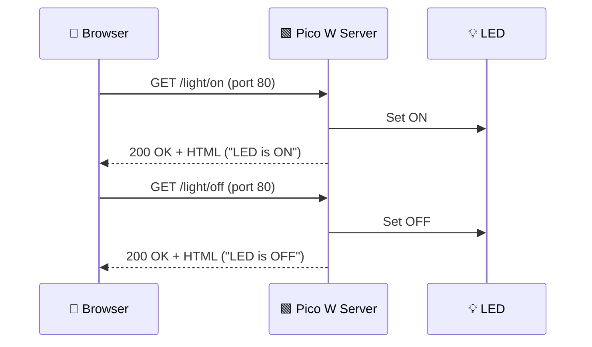

# 📡 Lab 9 — Wi‑Fi Connectivity (Raspberry Pi Pico W) + Tiny Web Server (REST API)

> **Goal:** Use the Raspberry Pi Pico W’s Wi‑Fi chip (MicroPython) to connect to an existing Wi‑Fi network and run a tiny HTTP server (port 80) implementing a basic REST-style API to control the on-board LED from a browser (e.g., smartphone).

---

## ✅ Lab Summary (What you will do)

1. **Connect Pico W to a Wi‑Fi network** (e.g., `ROBOTS`)
2. **Implement a tiny server** on the Pico W using sockets (listen on port **80**)
3. **Use a browser as a client** to send HTTP requests:
   - `/light/on`
   - `/light/off`


---

## 🌐 Overview: Why Wi‑Fi for Embedded / IoT?

Wi‑Fi is commonly available indoors (homes, workplaces, public spaces). This makes it convenient for connecting embedded/IoT devices **without building custom infrastructure**.

### Trade-offs
- ✅ **Convenient**: often already available (routers, hotspots)
- ✅ **High data rate**: great for web-style communication and dashboards
- ❌ **Not energy-efficient**: Wi‑Fi chips operate at high frequencies for fast data → more power use
- ✅ Indoors often means **mains power or easy recharging**, so Wi‑Fi becomes practical

> [!important]
> Wi‑Fi is “power-greedy” compared to BLE or LoRa, but is still a popular choice indoors.

---

## 🧩 Problems to Solve When Connecting an Embedded Device to Wi‑Fi

### 1) A Wi‑Fi network must exist
Options:
- Existing router Wi‑Fi (home/work)
- Smartphone hotspot (AP)
- Pico W can also create its own Wi‑Fi (AP mode)
- Dedicated router device

### 2) Device needs SSID + password
How to provide credentials:
- **Hardcoded (pre-programmed)** → OK for lab/dev
- **Provisioning** (runtime setup) → needed for mass production

> [!warning]
> Hardcoding credentials is risky if you share code (GitHub, classmates, etc.).

### 3) Devices in same Wi‑Fi must exchange data
In this lab: **Pico acts as server** and listens for HTTP requests.

> [!note]
> This does **not** require internet. Only LAN access is needed.

### 4) For “true IoT” (internet communication)
You need:
- LAN with internet access via router/WAP  
This is mentioned for next lab.

---

## 🧠 Architecture Used in This Lab: Server–Client (REST-ish)

### Why MCU as the server?
It’s often easier because:
- The MCU can “wait” for commands.
- The phone/computer can be the flexible client.

### REST API idea (simplified)
- You send commands using HTTP methods like **GET/POST/PUT**.
- In this lab we use **GET** with a path:
  - `GET /light/on`
  - `GET /light/off`

---

# ✅ Task 1 — Connect Pico W to an Existing Wi‑Fi

## MicroPython Library Used: `network`
MicroPython provides `network.WLAN(...)` to manage Wi‑Fi.

- `network.STA_IF` = **Station mode** (connect to an existing Wi‑Fi)
- `network.AP_IF` = **Access point mode** (create your own Wi‑Fi/hotspot)

---

## 🧾 Code 1 — Wi‑Fi connection helper (`WiFi.py`)

### What this function does
- Activates Wi‑Fi in station mode
- Attempts to connect
- Waits up to **10 seconds**
- Checks status codes
- On success prints assigned **IP address**
- On failure raises an error

> [!todo]
> Save this into a new script named `WiFi.py` and upload it to the Pico internal storage.

```python name=WiFi.py
import time
import network

# dictionary with network status codes
WiFi_status_codes = {
    0:  'Link down',
    1:  'Link join',
    2:  'No IP',
    3:  'UP-ok',
    -1: 'FAIL',
    -2: 'NONET',
    -3: 'BADAUTH'
}

def connect2wifi(ssid, password):
    """
    Tries to connect to the stated WiFi every second for 10 times.
    Prints error codes or current IP address if success
    Args:
      ssid (String): Network SSID
      password (String): Network password
    Returns:
      wlan (WLAN object): connection details in it
    """
    wlan = network.WLAN(network.STA_IF)
    wlan.active(True)
    wlan.connect(ssid, password)

    max_wait = 10
    while max_wait > 0:
        if wlan.status() < 0 or wlan.status() >= 3:
            break
        max_wait -= 1
        print('waiting for connection...')
        time.sleep(1)

    if wlan.status() != 3:
        print("Status: " + str(WiFi_status_codes[wlan.status()]))
        raise RuntimeError('network connection failed')
    else:
        print('connected')
        status = wlan.ifconfig()
        print('ip = ' + status[0])
        return wlan
```

### ✅ Interpreting the Wi‑Fi status
- `3 (UP-ok)` means connected successfully
- `-3 (BADAUTH)` typically means wrong password
- `2 (No IP)` can mean router didn’t assign DHCP address

---

## 🧾 Code 2 — Use `WiFi.py` to connect (main script)

In the lab, you connect to:
- SSID: `ROBOTS`
- Password: `LAB-M327`

```python name=main_connect_only.py
import WiFi
import socket
import time
from machine import Pin, Timer

led = Pin("LED", Pin.OUT)
led.value(1)

my_ssid = 'ROBOTS'
my_password = 'LAB-M327'

myWlan = WiFi.connect2wifi(my_ssid, my_password)

led.value(0)
```

### 🔎 Important output: IP address
You must write down the assigned IP:
- Format: `192.168.X.Y`
- All devices share the same `X` in the same LAN
- Your Pico gets a unique `Y`

> [!important]
> You will use this IP address in the browser URL later.

---

## ⚠️ Public Wi‑Fi warning (eduroam example)
Some public/shared Wi‑Fi (like **eduroam**) requires user-level login, not just a shared password.

Problems:
- You would need to store personal credentials on the microcontroller.
- Anyone with access to the device/code may obtain them.

So in labs we use a simple password-only Wi‑Fi (like `ROBOTS`) or a personal hotspot.

---

## 🛠️ Common Issue: “address already in use”
If you reset and reconnect and get an “address in use” type issue:
- Disconnect USB power (unplug USB)
- Plug it back in
- Run again

---

# ✅ Task 2 — Serve a RESTful API (Tiny HTTP Server)

Once connected, Pico W becomes a **basic web server**:
- Listens on **port 80** (HTTP)
- Receives requests
- Parses the URL path
- Controls LED accordingly
- Responds with a small HTML page

---

## 🧠 Core concept: sockets
A socket is like a communication endpoint:
- Server binds to an address + port
- Listens for connections
- Accepts client connections
- Receives request bytes
- Sends back response bytes

---

## 🧾 Code 3 — Create a socket listening on port 80

```python name=socket_listen_port80.py
# Open socket to listen on port 80 (HTTP)
addr = socket.getaddrinfo('0.0.0.0', 80)[0][-1]
s = socket.socket()
s.bind(addr)
s.listen(1)
print('listening on', addr)
```

### What does `0.0.0.0` mean?
It means “listen on all available network interfaces,” i.e. accept traffic directed to the Pico’s IP.

---

## 🧾 Code 4 — Prepare the HTML response

This is a template string representing a tiny web page.

```python name=html_template.py
html_page = """<!DOCTYPE html>
<html>
 <head> <title>Pico W</title> </head>
 <body> <h1>Pico W</h1>
 <h2><p>%s</p></h2>
 </body>
</html>
"""
```

### Why `%s`?
`%s` is a placeholder where we insert dynamic text (like LED status) right before sending.

Example:
- `%s` replaced with `"LED is ON"`

---

## 🧾 Code 5 — Accept requests, parse path, act, respond

### What the request looks like (typical)
A browser will send something like:

`b'GET /light/on HTTP/1.1\r\nHost: 192.168.X.Y\r\n...'`

We do **basic parsing** by searching the string for substrings:
- `'/light/on'`
- `'/light/off'`

Using `find()`:
- returns index where substring begins
- returns `-1` if not present

In the provided lab logic:
- The command starts at position **6** (because the string includes `"b'GET "` first)

```python name=request_handling_loop.py
while True:
    try:
        cl, addr = s.accept()  # client socket
        print('client connected from', addr)

        request = cl.recv(1024)
        request = str(request)
        print(request)

        led_on = request.find('/light/on')
        led_off = request.find('/light/off')

        print('led on = ' + str(led_on))
        print('led off = ' + str(led_off))

        if led_on == 6:
            print("led on")
            led.value(1)
            stateis = "LED is ON"
        elif led_off == 6:
            print("led off")
            led.value(0)
            stateis = "LED is OFF"

        response = html_page % stateis
        cl.send('HTTP/1.0 200 OK\r\nContent-type: text/html\r\n\r\n')
        cl.send(response)
        cl.close()

    except OSError as e:
        cl.close()
        print('connection closed')

    time.sleep(1)
```

> [!note]
> This parsing approach is intentionally simple for the lab. Later you’ll learn more robust HTTP parsing.

---

## ✅ Final Program (Task 1 + Task 2 combined)

> [!todo]
> Combine Code 2 + 3 + 4 + 5 into one file (e.g., `main.py`) and run it.
> Make sure `WiFi.py` is already uploaded to the Pico.

```python name=main.py
import WiFi
import socket
import time
from machine import Pin

led = Pin("LED", Pin.OUT)
led.value(1)

# 1) Connect to Wi-Fi
my_ssid = 'ROBOTS'
my_password = 'LAB-M327'
myWlan = WiFi.connect2wifi(my_ssid, my_password)

led.value(0)

# 2) Prepare HTML response template
html_page = """<!DOCTYPE html>
<html>
 <head> <title>Pico W</title> </head>
 <body> <h1>Pico W</h1>
 <h2><p>%s</p></h2>
 </body>
</html>
"""

# 3) Create socket on port 80
addr = socket.getaddrinfo('0.0.0.0', 80)[0][-1]
s = socket.socket()
s.bind(addr)
s.listen(1)
print('listening on', addr)

# 4) Serve requests forever (debug version)
while True:
    try:
        cl, addr = s.accept()
        print('client connected from', addr)

        request = cl.recv(1024)
        request = str(request)
        print(request)

        led_on = request.find('/light/on')
        led_off = request.find('/light/off')

        if led_on == 6:
            led.value(1)
            stateis = "LED is ON"
        elif led_off == 6:
            led.value(0)
            stateis = "LED is OFF"
        else:
            stateis = "Unknown command (try /light/on or /light/off)"

        response = html_page % stateis
        cl.send('HTTP/1.0 200 OK\r\nContent-type: text/html\r\n\r\n')
        cl.send(response)
        cl.close()

    except OSError:
        try:
            cl.close()
        except:
            pass
        print('connection closed')

    time.sleep(1)
```

---

# ✅ Task 3 — Use a Browser to Control the Pico W

## Steps (using your phone)
1. Disconnect phone from `eduroam`
2. Connect phone to **ROBOTS** Wi‑Fi  
   - It may say “no internet” — that’s fine (LAN is enough)
3. Open browser and type (replace with Pico’s IP):
   - `192.168.X.Y/light/on`
4. LED should turn ON, browser shows an HTML page
5. Turn LED off:
   - `192.168.X.Y/light/off`



---

# 🔐 Security Notes (Very Important)

## HTTP is insecure
- The lab uses **HTTP**, not HTTPS.
- Data is sent in **plain text** (unencrypted).
- Anyone on the same Wi‑Fi can:
  - send requests to your Pico
  - read traffic (depending on network)
  - potentially spoof a device if IP addresses change

> [!danger]
> Never transmit critical/private information over plain HTTP in shared networks.

### Possible improvement (partial)
- Restrict which devices can join Wi‑Fi via MAC allowlist on the hotspot/router  
But:
- Still no encryption on HTTP payload.

---

# 💡 Extensions / “Think About It” (Conceptual)

## 1) A microcontroller could be the client too
Instead of phone browser, another MCU could:
- send HTTP requests
- parse the returned HTML/text
- react accordingly

## 2) Power-saving idea: “check Wi‑Fi occasionally”
A remote MCU could:
- wake every few minutes
- check if a specific hotspot SSID exists
- only connect and interact when you come nearby and enable your hotspot
- otherwise go back to low-power waiting

## 3) Evolve from LAN → Internet IoT
If your Wi‑Fi has internet access:
- the Pico could talk to cloud APIs (next lab topic)

---

# 🧰 Appendix A — Lab Materials Checklist

Make sure you have:
- Raspberry Pi Pico W mounted in a breadboard
- USB cable
- Lab-provided device creating **ROBOTS** Wi‑Fi (router/hotspot)

---

# 📝 Quick Troubleshooting Checklist

## Pico won’t connect to Wi‑Fi
- SSID/password correct?
- Is Wi‑Fi network available?
- Check printed status codes (`BADAUTH`, `NONET`, etc.)

## Browser can’t reach Pico
- Phone connected to same Wi‑Fi (ROBOTS)?
- Using correct Pico IP?
- Pico program still running and listening?
- Try ping (if your device allows) or reload page

## “Address already in use” after reset
- Unplug Pico USB power fully
- Plug back in, run again

---

# 🧠 Key Takeaways

- Pico W can connect to a Wi‑Fi using MicroPython `network.WLAN(STA_IF)`
- IP address is essential to communicate over LAN
- Socket server on port 80 can handle HTTP requests
- Simple REST-like endpoints can control hardware (LED)
- LAN communication doesn’t require internet
- HTTP is insecure → don’t use for sensitive data