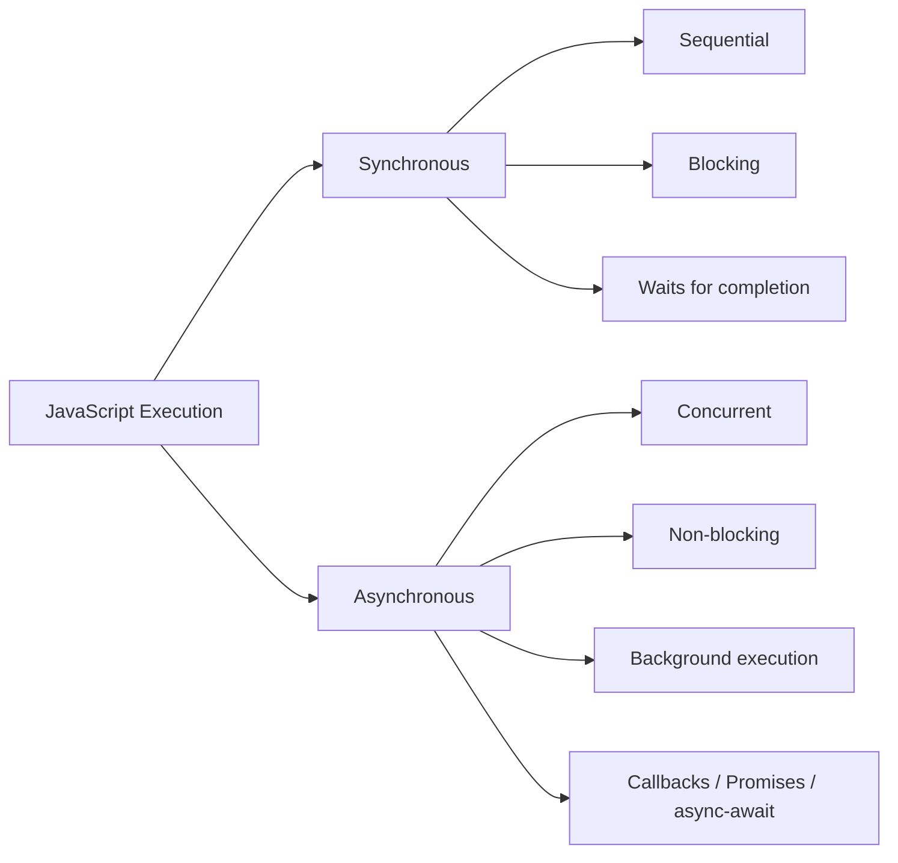
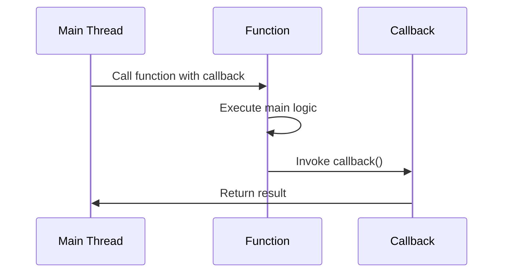
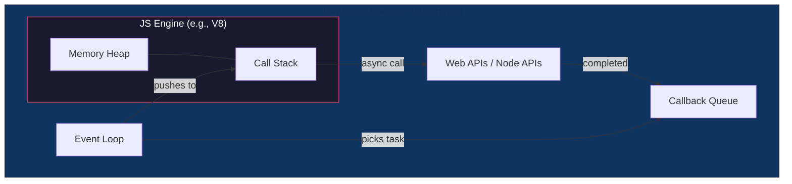
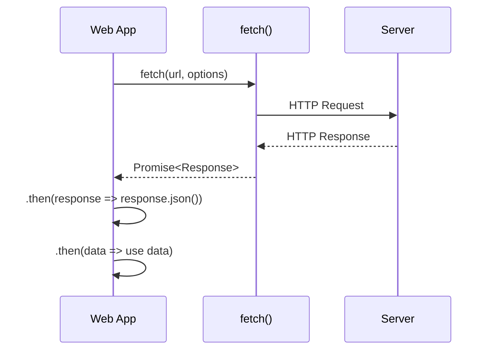
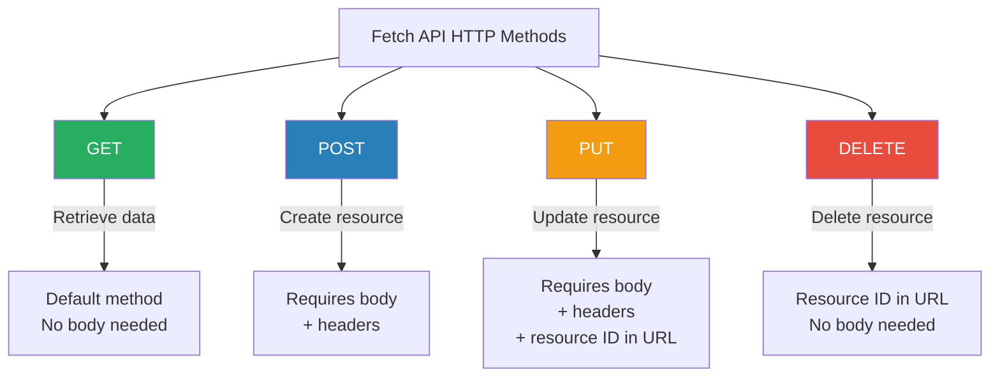
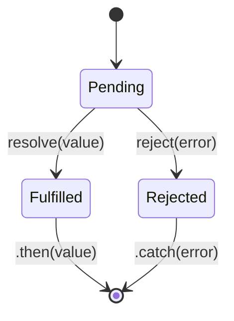
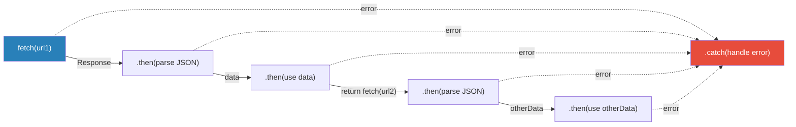
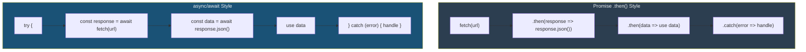
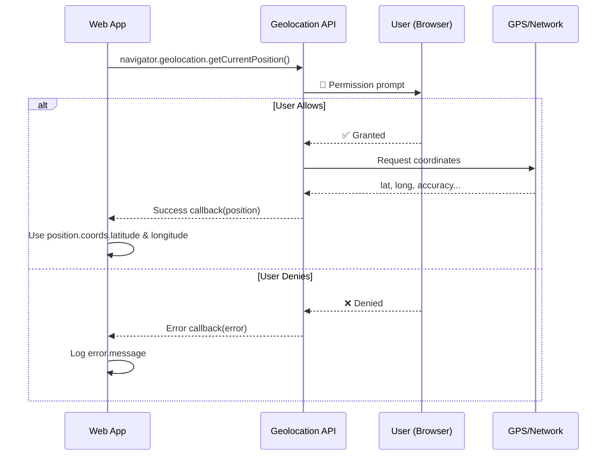
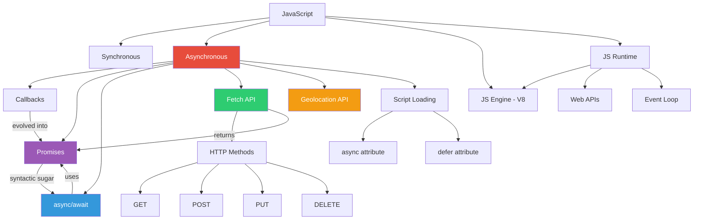

# 🚀 FNCC Lecture 3 — Asynchronous JavaScript Review

## 1 — Synchronous vs Asynchronous JavaScript

### 🔄 Synchronous JavaScript
- Executed **sequentially** (line by line)
- **Waits** for the previous operation to finish before moving to the next
- Blocks the main thread

### ⚡ Asynchronous JavaScript
- Multiple operations execute **in the background**
- Does **NOT block** the main thread
- Enables responsive UIs and efficient I/O

### 🗺️ Concept Map



### 📊 Comparison Table

| Feature             | Synchronous               | Asynchronous                  |
| ------------------- | ------------------------- | ----------------------------- |
| Execution Order     | Sequential                | Concurrent / Non-sequential   |
| Blocking            | ✅ Yes                    | ❌ No                         |
| Main Thread         | Occupied                  | Free for other tasks          |
| Use Case            | Simple scripts            | API calls, timers, file I/O   |
| User Experience     | Can freeze UI             | Smooth & responsive           |

### 🎨 Visual Timeline

```
SYNCHRONOUS
─────────────────────────────────────────────►  time
│ Task A ██████│ Task B ██████│ Task C ██████│
  (waits)        (waits)        (done)

ASYNCHRONOUS
─────────────────────────────────────────────►  time
│ Task A ██████──────────────────────────────│
│      Task B ██████─────────────────────────│
│           Task C ██████────────────────────│
  (all start without waiting for each other)
```

---

## 2 — Threads & Callback Functions

### 🧵 Thread
> A **thread** is a sequence of instructions that can be executed **independently** of the main program flow.

- JavaScript is **single-threaded** (one main thread)
- Async operations are handled by the **runtime environment** (browser/Node.js), not extra JS threads

### 📞 Callback Functions
> Functions **passed as arguments** to other functions, executed **after** the completion of an operation or as a result of an event.

```javascript
function greet(name, callback) {
  console.log("Hello, " + name);
  callback();
}

greet("Alice", function () {
  console.log("Callback executed!");
});
```

### 🗺️ Callback Flow Diagram



> ⚠️ **Callback Hell**: Nesting too many callbacks leads to unreadable "pyramid of doom" code. Promises & async/await solve this.

---

## 3 — JavaScript Engine vs JavaScript Runtime

### 🏭 JavaScript Engine
- A **program** that executes JavaScript code
- Works like a **converter**: code → machine instructions
- **Example:** Google's **V8** engine (used in Chrome & Node.js)

### 🌐 JavaScript Runtime
- The **environment** in which JS code runs
- **Includes:**
  - The JS Engine (core execution)
  - Additional APIs (DOM, Fetch, Timers, etc.)
  - Event Loop & Callback Queue

### 🗺️ Architecture Map



### 📊 Engine vs Runtime Comparison

| Aspect          | JS Engine                    | JS Runtime                         |
| --------------- | ---------------------------- | ---------------------------------- |
| What it is      | Code executor                | Full execution environment         |
| Contains        | Call Stack + Memory Heap     | Engine + APIs + Event Loop + Queue |
| Example         | V8, SpiderMonkey             | Chrome Browser, Node.js            |
| Scope           | Parsing & executing JS only  | JS + networking, DOM, timers, etc. |

---

## 4 — The Fetch API

### 📡 What is the Fetch API?
- Allows web apps to make **network requests** (HTTP)
- Typically used to **retrieve** or **send** data to a server
- Provides a global `fetch()` method
- Returns a **Promise**

### 📦 Data Types You Can Fetch
- 📝 Text
- 🖼️ Images
- 🎵 Audio
- 📊 JSON
- ...and more

### 🗺️ Fetch API Flow



---

## 5 — HTTP Methods for Fetch API

### 🗺️ HTTP Methods Overview



### 📊 HTTP Methods Comparison Table

| Method   | Purpose         | Body Required? | Headers Required? | URL Example                              |
| -------- | --------------- | -------------- | ----------------- | ---------------------------------------- |
| `GET`    | Retrieve data   | ❌ No          | ❌ Optional       | `api.example.com/data`                   |
| `POST`   | Create resource | ✅ Yes         | ✅ Yes            | `api.example.com/users`                  |
| `PUT`    | Update resource | ✅ Yes         | ✅ Yes            | `api.example.com/users/45`               |
| `DELETE` | Delete resource | ❌ No          | ❌ Optional       | `api.example.com/users/45`               |

---

### 🟢 GET — Retrieve Data

> By default, `fetch()` uses `GET`.

```javascript
// Simple GET request
fetch('https://api.example.com/data')

// GET with JSON parsing
fetch('https://api.example.com/data')
  .then(response => response.json())
  .then(data => console.log(data))
```

> 💡 The response from `fetch()` is a **Promise**. The `.then()` handler converts the response to JSON.

---

### 🔵 POST — Create Resource

```javascript
fetch('https://api.example.com/users', {
  method: 'POST',
  headers: {
    'Content-Type': 'application/json',
  },
  body: JSON.stringify({
    name: 'John Doe',
    email: 'john@example.com'
  })
})
```

> 📝 **Key Points:**
> - `method: 'POST'` — specifies the HTTP method
> - `headers` — tells the server we're sending JSON
> - `body` — must be a **string** → use `JSON.stringify()`

---

### 🟡 PUT — Update Resource

```javascript
fetch('https://api.example.com/users/45', {
  method: 'PUT',
  headers: {
    'Content-Type': 'application/json',
  },
  body: JSON.stringify({
    name: 'John Smith',
    email: 'john@example.com'
  })
})
```

> 📝 **Key Points:**
> - The **resource ID** (`45`) is in the URL
> - The `body` contains the **updated data**

---

### 🔴 DELETE — Delete Resource

```javascript
fetch('https://api.example.com/users/45', {
  method: 'DELETE'
})
```

> 📝 **Key Points:**
> - Only the URL with the **resource ID** and the `method` are needed
> - No body required

---

### 🎨 CRUD ↔ HTTP Methods Mapping

```
┌─────────────────────────────────────────────────┐
│              CRUD Operations Map                │
├────────────┬────────────┬───────────────────────┤
│  CRUD      │  HTTP      │  Description          │
├────────────┼────────────┼───────────────────────┤
│  Create    │  POST      │  Add new resource     │
│  Read      │  GET       │  Fetch existing data  │
│  Update    │  PUT       │  Modify resource      │
│  Delete    │  DELETE    │  Remove resource      │
└────────────┴────────────┴───────────────────────┘
```

---

## 6 — Promises & Promise Chaining

### 🤝 What is a Promise?

> A **Promise** is an object representing the **eventual completion or failure** of an asynchronous operation and its resulting value.

### 🗺️ Promise States Diagram



### 📊 Promise States Table

| State        | Description                        | Handler     |
| ------------ | ---------------------------------- | ----------- |
| **Pending**  | Initial state, neither fulfilled nor rejected | —           |
| **Fulfilled**| Operation completed successfully    | `.then()`   |
| **Rejected** | Operation failed                   | `.catch()`  |

---

### ✏️ Creating a Promise

```javascript
const promise = new Promise((resolve, reject) => {
  setTimeout(() => {
    resolve('Data received successfully');
  }, 2000);
});
```

### ✏️ Consuming a Promise with `.then()` and `.catch()`

```javascript
promise
  .then(data => {
    console.log(data);       // "Data received successfully"
  })
  .catch(error => {
    console.error(error);    // handles any errors
  });
```

> 💡 `.then()` → runs on **fulfillment**
> 💡 `.catch()` → runs on **rejection**

---

### 🔗 Promise Chaining

> Chain multiple `.then()` calls to perform **sequential async operations**. Each `.then()` can return a **new Promise**.

```javascript
fetch('https://api.example.com/data')
  .then(response => response.json())       // Step 1: Parse JSON
  .then(data => {
    console.log(data);                      // Step 2: Use data
    return fetch('https://api.example.com/other-data'); // Step 3: New fetch
  })
  .then(response => response.json())       // Step 4: Parse JSON
  .then(otherData => {
    console.log(otherData);                // Step 5: Use other data
  })
  .catch(error => {
    console.error(error);                  // Catches ANY error in the chain
  });
```

### 🗺️ Promise Chaining Flow



> 🎯 **Key Benefit:** A single `.catch()` at the end handles errors from **any step** in the chain.

---

## 7 — Async/Await

### 🌟 What is async/await?

> Built **on top of Promises**, `async/await` makes writing and reading asynchronous code **easier and cleaner**.

### 📊 Keywords Table

| Keyword  | Where Used              | What It Does                                              |
| -------- | ----------------------- | --------------------------------------------------------- |
| `async`  | Before function declaration | Marks function as asynchronous; it returns a **Promise**  |
| `await`  | Inside async function only  | **Pauses** execution until the Promise resolves            |

---

### ✏️ Basic Example

```javascript
async function delayedGreeting(name) {
  console.log("A Messenger entered the chat...");
  await new Promise(resolve => setTimeout(resolve, 2000));
  console.log(`Hello, ${name}!`);
}

delayedGreeting("Alice");
console.log("First Printed Message!");
```

### 🎨 Execution Order Visualization

```
Timeline ──────────────────────────────────────────►

1. delayedGreeting("Alice") called
2. Logs: "A Messenger entered the chat..."
3. await pauses delayedGreeting (2 sec timer starts)
4. Logs: "First Printed Message!"  ← runs while awaiting!
   ... 2 seconds pass ...
5. Logs: "Hello, Alice!"

Output:
┌──────────────────────────────────┐
│ A Messenger entered the chat...  │
│ First Printed Message!           │
│ Hello, Alice!                    │  ← after 2s delay
└──────────────────────────────────┘
```

---

### 🛡️ Error Handling with try/catch

```javascript
async function fetchData() {
  try {
    const response = await fetch('https://api.example.com/data');
    const data = await response.json();
    console.log(data);
  } catch (error) {
    console.error(error);
  }
}

fetchData();
```

> 💡 `try` → wraps code that **might throw**
> 💡 `catch` → handles the error gracefully

### 🗺️ Promises vs Async/Await Comparison



### 📊 Promises vs Async/Await Table

| Feature          | Promises (`.then`)           | Async/Await                    |
| ---------------- | ---------------------------- | ------------------------------ |
| Readability      | Can get nested               | Reads like synchronous code    |
| Error Handling   | `.catch()` at end of chain   | `try/catch` blocks             |
| Debugging        | Harder to trace              | Easier stack traces            |
| Chaining         | `.then().then().then()`      | Sequential `await` statements  |
| Foundation       | Core async primitive         | Built on top of Promises       |

---

## 8 — The async & defer Attributes

### 📜 Script Loading Strategies

These HTML attributes control how **external** `<script>` files are loaded relative to HTML parsing.

---

### ⚡ `async` Attribute
- Downloads script **asynchronously** (in parallel with HTML parsing)
- Once downloaded → **pauses HTML parsing** → executes script → **resumes parsing**
- Use for **independent scripts** where order doesn't matter

### ⏳ `defer` Attribute
- Downloads script **asynchronously** (in parallel with HTML parsing)
- Execution is **deferred** until HTML is **fully parsed**
- **Maintains order** of scripts as they appear in the document

---

### 🎨 Visual Timeline Comparison

```
NORMAL <script>
HTML:  ████████░░░░░░░░████████████████████
Script:         ████████
                ↑ parse   ↑ execute
                  paused    resumes

ASYNC <script async>
HTML:  ██████████████░░░░████████████████████
Script:    ▓▓▓▓▓▓▓▓████
           ↑ download   ↑ execute (pauses HTML)
           (parallel)     resumes after

DEFER <script defer>
HTML:  ████████████████████████████████████ ✅
Script:    ▓▓▓▓▓▓▓▓                    ████
           ↑ download                   ↑ execute
           (parallel)                   (after HTML done)
```

### 📊 Comparison Table

| Feature              | Normal `<script>`     | `async`                  | `defer`                  |
| -------------------- | --------------------- | ------------------------ | ------------------------ |
| Download             | Blocks HTML parsing   | Parallel to parsing      | Parallel to parsing      |
| Execution Timing     | Immediately           | As soon as downloaded    | After HTML fully parsed  |
| Order Maintained     | ✅ Yes                | ❌ No                    | ✅ Yes                   |
| Inline Scripts       | ✅ Works              | ❌ Ignored               | ❌ Ignored               |
| Best For             | Critical inline code  | Analytics, ads           | DOM-dependent scripts    |

> ⚠️ **Important Rules:**
> - Both `async` and `defer` are **ignored for inline scripts** — they only work for **external** script files
> - When **both** `async` and `defer` are present, **`async` takes precedence**

---

## 9 — Geolocation API

### 📍 What is the Geolocation API?
> Provides a way for websites to **request the user's location** (with their permission).

### ✏️ Example: `getCurrentPosition()`

```javascript
navigator.geolocation.getCurrentPosition(
  (position) => {
    console.log("Latitude: " + position.coords.latitude);
    console.log("Longitude: " + position.coords.longitude);
  },
  (error) => {
    console.log("Error: " + error.message);
  }
);
```

### 🗺️ Geolocation API Flow



### 📊 Position Object Properties

| Property                      | Description                     |
| ----------------------------- | ------------------------------- |
| `position.coords.latitude`    | Latitude in decimal degrees     |
| `position.coords.longitude`   | Longitude in decimal degrees    |
| `position.coords.accuracy`    | Accuracy of position in meters  |
| `position.coords.altitude`    | Altitude (if available)         |
| `position.coords.speed`       | Speed (if available)            |
| `position.timestamp`          | Time when position was obtained |

> 🔒 **Privacy Note:** Always respect the user's privacy. Only request location **when necessary** and explain why.

---

## 10 — Master Cheat Sheet

### 🗺️ Complete Topic Relationship Map



### 📋 Quick Reference Card

```
┌────────────────────────────────────────────────────────────────┐
│                    ASYNC JS QUICK REFERENCE                    │
├────────────────────────────────────────────────────────────────┤
│                                                                │
│  FETCH:    fetch(url)              → Returns Promise           │
│  GET:      fetch(url)              → Default method            │
│  POST:     fetch(url, {method:'POST', body:..., headers:...})  │
│  PUT:      fetch(url/id, {method:'PUT', body:..., headers:..}) │
│  DELETE:   fetch(url/id, {method:'DELETE'})                    │
│                                                                │
│  PROMISE:  new Promise((resolve, reject) => {...})             │
│            .then(data => ...)                                  │
│            .catch(err => ...)                                  │
│                                                                │
│  ASYNC:    async function fn() { const x = await promise; }    │
│            try { ... } catch (e) { ... }                       │
│                                                                │
│  SCRIPT:   <script async src="...">  → Download & exec ASAP    │
│            <script defer src="...">  → Download & exec after   │
│                                        HTML fully parsed       │
│                                                                │
│  GEO:      navigator.geolocation.getCurrentPosition(ok, err)   │
│            position.coords.latitude / longitude                │
│                                                                │
└────────────────────────────────────────────────────────────────┘
```
